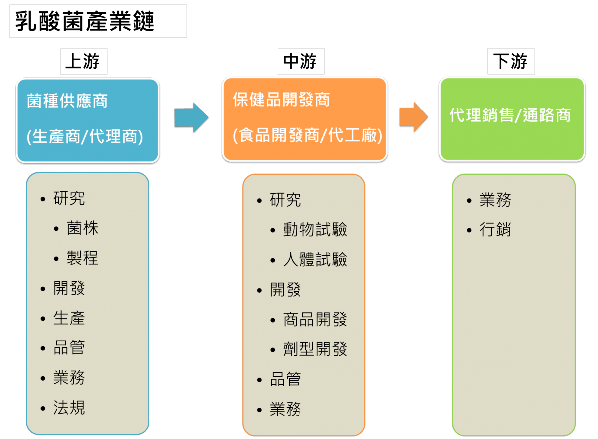

首先就從產業鏈看起吧!! 乳酸菌產業鏈簡單地區隔可分為上、中、下游。上游為菌種供應商(研發廠商)，中游為保健品開發商，下游為代理銷售及通路商。上中下游廠商的功能與職位需求皆有所不同(見下圖)。接下來就一一說明上中下游的不同：

## **上游**

菌種供應商屬此產業之上游，提供各類菌種原料給中下游。菌種供應商的公司組織通常囊括，生產、銷售、研發、品管等部門，主要客戶為其他企業，即B2B。目前台灣的現況，上游公司主要分為兩大類型，一者有著研發單位及生產單位，會進行菌株分離(開發)，同時也會生產自行開發的菌株；而另一類型則是單純進行販售，販售的菌種有來自國外的品牌產品，也有委託生產商製造的產品。

從職務需求來看，研發及生產工作需要的包含研發人員、生產(生管)人員、品管人員及業務人員，以下針對各職務個別介紹。

**研發人員(分為研究與開發兩類型)**

菌種研究的目標通常著重在新菌株探索及菌株培養製程開發。具微生物相關技術的研究人員進行菌株研發；具發酵經驗者進行製程開發；熟稔細胞實驗或動物實驗的研究員則能執行初步的功能性的篩選；少數廠商可能還會更進一步需要負責人體臨床試驗的人員。此外，有些公司也會需要蛋白質純化或分生技術的人員進行更深入的研究。研發工作的內容百百種，各公司因發展策略而有所不同，也可能因為人力分配的緣故需要兼職多項工作。至於開發方面，主要是著重於發展菌株的應用性及不同類型的產品，例如開發不同劑型的產品(膠囊、錠劑、粉劑)，有點類似製藥業的劑型開發，或者開發一般消費食品，如優酪乳、乳酸飲品、優格冰淇淋等。也因如此，研發人員之技術背景需求較為廣泛，包含：微生物、發酵、食品加工、細胞實驗、動物實驗、免疫學、分子生物學背景......等。

**生產人員**

工作內容多以進行發酵培養及相關後續製程，，而生產管理人員則負責安排生產排程及各項資源的準備。生產及管理人員同時也有可能參與製程開發或製程優化等工作。甚至，有些公司會希望這個職位的人員同時具備設備維護、保養處理等經驗。因此，生產相關人員之技術背景需求除了設備操作經驗、生產管理、生產規程、品質標準、法規外，也可能需要了解微生物、食品加工、機械工程、生物學、化學工程、等專業。

**品管人員**

主要是對生產產品進行品質把關，但也可能需要協助工廠進行衛生管理、稽核、驗證等工作。背景需求通常包含微生物學、食品科學、食品營養、檢驗分析、儀器操作、法規、分析方法確效試驗等專業。

**業務人員**

通常會區分為國內業務及國外業務，除了銷售外，也需配合公司進行業務開發、接洽OEM/ODM事務，也可能會負責國內外商展，參與企劃，協調行銷活動等等。部分公司則會將業務與行銷合併，端看各公司之組織架構而定。背景需求多數還是希望擁有生物學相關、食品營養相關、食品科學相關，也有公司不限定。

而以學歷要求來看，工作若與研發或開發有關者，多數廠商依然是以碩士為主，學士較不易進入；而其他工作則僅需大學畢業即可。

若公司是屬僅單純進行販售者，工作職缺主要會以業務為主。但這類公司可能也會需要研發人員，只不過這些研發人員大多並不會需要做實驗，而是比較像是產品專員，了解原料資訊，判斷原廠提供的實驗數據是否正確，或與競品做比較等；或是進行文獻整理，提供業務更多的資訊來推銷產品。但仍有些公司會進行少量之開發產品或研發工作。然而，這類公司依然不可缺少品管人員：負責確保產品之安全衛生及品質，以及法規專員：負責查驗登記、進出口申請或研究各國相關管理法規等。

## **中游**

保健品開發商之公司組成其實大致上與菌種供應商(生產商)相似，但多數並沒有菌種生產單位。而在產品線部分，相較上游的菌種供應商，可能多僅有幾株主力菌株，相對來說產品線較窄。且終端產品多為消費產品，客戶以一般消費者，即B2C為主。中游廠商多把精力投注於開發及銷售上，生產活動則可委外進行：原料生產委託上游菌種供應商(生產商)，產品生產委託專業代工廠商製造。而公司的開發目標，多以開發特定菌株之功能或相關產品為主，因此多投入於產品保健功能開發、劑型的開發或產品品質提升等。在功能開發上，需要具細胞實驗/動物實驗經驗的人員，也可能需要規劃臨床試驗的人員。而在新產品開發、劑型開發或產品品質提升上，需要具食品、營養、食品加工或相關生物背景的人員。

除了保健品開發商之公司外，也會有利用乳酸菌開發食品的一般食品公司，如：乳品加工業者、發酵飲品開發業者，以及較著重於生產代工的廠商等。這類公司在研發的投入較低，生產、品管及業務的比例較高。因此通常會需要食品相關背景的人員，如食品科技、營養或食品加工等。

整體來說，中游廠商所需要之人員背景需求與菌株供應商(生產商)相同，且多需要碩士畢業，但所進行之事務較偏向應用層面。同時，中游廠商也都設有品管及業務部門，需求也與上述之菌種供應商相同。

## **下游**

整個產業鏈的最下游就是第一線接觸接觸消費者的代理銷售/通路商。保健食品類的通路多為藥妝店或藥局，而若屬消費食品類則為便利商店或各大賣場。但近年因網路的普及及發展，許多銷售也開始轉往網路購物。因此職務需求多為業務或行銷類。因此通常會需要食品相關專業背景的人員，如食品科技、營養等，若具有營養師執照或通過保健食品初級工程師能力鑑定更有優勢。甚至，部分業者更喜歡擁有藥學背景的人員，認為能帶給消費者更多的信任。

## **總結**

從產業現況來看，上中下游目前的區隔越來越模糊，上游的菌種供應商也開始往下游進行整合，自行開發終端產品往B2C市場銷售，中游保健食品開發商也有開始往上游拓展，設置生產部門或自行開發新穎菌株，同時也因利用網路開始自行販售。這樣上下游整合的現象也會反應在各公司的人力需求上。從市場動態及人力需求的變化，常常能看出一間公司的發展策略，而從產業鏈之變化更能看到產業發展的態樣，這些都是在職涯規劃時之重要參考資料。
