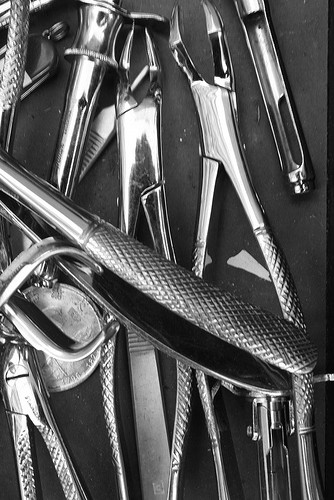

大家都知道所謂的 80/20 法則，業務的增長也是如此，你大多數的初期成長，是來自於你專注的一兩個醫院及大客戶。我們都知道，這樣的生意有一定風險，所以老闆也一定會要求我們增加客戶群，或許經由我們的努力，我們的客戶基礎擴大了，但是，如果我們不注重大客戶的維持，往往我們辛辛苦苦所做出來的一些成果，還沒有這幾個大客戶轉投敵營的損失多，所以，幾乎所有的醫藥公司都把 KOL (Key Opinion Leader, 亦即有影響力的大人物) Management 當作是業務最重要的工作來看待。

## **大人物的管理**

在我的經驗裡，大人物的管理可以分為四種層次，首先是**定期的拜訪**，然後是**進一步關係的建立**，**臨床醫療的協助**，以及**醫師的生涯規劃**。這中間有些層次會互相重疊，有些層次會因為你經營產品的限制而很難做到 (以個人經驗為例，過去經營較低階耗材時很不容易經營出高層次的關係，但是在擴張營業範圍到較高階耗材以後，就有較高的機會進入臨床醫療參與協助的部分)，不同的層次往往反映了不同的投資與效益，越高層次的管理除了越大的投資及預期效益以外，往往也越能緊密的將客戶與我們的利益結合在一起，反面來說，有時也意味著更大的風險。

**定期拜訪**

定期的拜訪是所有商業關係的基礎，拜訪的技巧大家各有門派，因此我只提醒以下幾點：**第一，**當沒有任何資訊如何找一個醫師時，門診是唯一 90% 以上可以接觸到醫生的地方。然而身為器材代表的我，更喜歡在下診時間拜訪，然而其缺點是時間往往無法確定 (取決於醫生的看診時間)，但是下診往往有機會談得較為深入，甚至一起用餐等。**第二**，醫療器材往往需要較長的時間溝通，所以不適合上診前拜訪，這也是為了保護病人權益，況且傳統上，上診是屬於藥商的時間。

**Tip! 如何跟醫生更進一步聯絡：** 經過前期的經營後，如果之後還需要更多的溝通，我往往不希望再浪費時間在等診，而是希望與醫師直接相約會面時間。我經常使用的話術是"請問之後的事情我要跟哪一位秘書或小姐先約嗎?" 這樣的問法可以迴避直接要電話的尷尬，有時醫師就會直接給你電話或是聯絡人的電話。

在每次的拜訪留下適當的 FOLLOW UP 事項，大概就可以建立與這位醫師恰當的定期拜訪基礎，這也是所有客戶關係經營的基礎!

**建立進一步關係－日常生活的協助**

在一段時間的熟悉後，有些醫師會拜託你協助一些生活事項，因為台灣醫師的生活環境單純，並且過度忙碌，所以跟很多其他行業的業務一樣，與顧客更進一步關係的往往建立於日常生活事項的協助。而日常生活的協助往往是新鮮人與藥商較常經營的手法 (傳統上，負擔這方面的儀器業務與器材業務較藥商來得少)。而日常生活協助的項目可說是包羅萬象，接送家人、汽車保養、維修3C產品等... 然而重點是，雖然這些工作未必會給你你想要的生意成長，但是或許能給你一些潛在的幫助，比如說業界情報或是醫院流程的熟悉等。 經營客戶關係的方式很多，如果你不想要把這些當作你的客戶管理主要手段，第一次接到REQUEST時就該果斷拒絕，也可能沒有任何損失，而其中的利害得失就得由個人評估了。

**臨床服務－醫療器材業務最重要的客戶經營方式**

所謂臨床服務，內容極為廣闊，包括跟診、跟刀、教育護理人員、介紹產品操作、篩選適當病人、衛教、提供試用品、文獻搜尋等等，總之，可以為醫師的醫療行為增加價值的工作都可以歸在這個範圍。這也是一些大廠之所以不同於小廠的最主要原因：大廠能夠提供一批經過專業訓練、舉止合宜、了解醫院規範與倫理、業務分際，並且有足夠的專業知識與經驗，協助醫師判斷、給予醫師信任與安全感的業務，這才是業務持續增長的真正關鍵。(畢竟醫師離開教學醫院以後，雖然持續進修，但是醫療器械的發展日新月異，並且各家設計理念及使用方式均不同，業務的專業程度，可以直接影響許多面向，包括病人的選擇、適當尺寸的選擇、輔助醫材的使用、病人的術前及麻醉準備等。)

舉例來說，針對第一次進行開刀服務的醫院，我一定會先想辦法找到醫師或負責的專科護理師，深入了解病人的診斷、症狀、綜合身體狀況、醫院現有的相關器械是否缺乏或老舊等等事項，然後做出我的建議，這個建議有時甚至是取消手術。這一切的準備，可以讓手術進行順暢，建立醫師與團隊的信心，在未來才可以有更多的產品使用。另一方面，排除不適合的病人，除了減少醫療團隊的挫敗感以外，最重要的是幫助醫院及公司遠離醫療糾紛甚至刑事責任，這些事情只要一旦發生，可能就是客戶跟我們的職涯終點，不可不慎! 最後，我們的生意成長了，醫生的聲望也增高了，下一步呢?

**參與大人物的生涯規劃**

有些醫師會滿足於一定程度的成就，而有些時候我們也可以安於現狀。但是，也有一些醫師具有巨大潛力，我們的責任便是發掘他們、運用公司的資源讓他們進入事業的另一高峰。我在這方面的經驗尚未十分豐富，但願意就幾個點來與大家討論。 第一：**大人物的目標選擇**。必須有足夠學經歷、醫療專業堅強，並擁有醫院的支持，如此一來之後在推動許多學術活動時才不至於受到許多制肘，最好是醫院甚至醫界高層的天子門生，或出身於大的學派，如此影響力才能及於更多的客戶。 第二：**資源的投入必須有長期規劃**。配合公司主打的議題，與醫院達成至少1-3年，最好是3-5年的合作承諾。針對某些議題除了醫師個人的投資，也要針對整個醫療團隊的其他人作出投資。 第三：**容忍**。當我們客戶逐漸成為一個大大人物，對於一些事我們要適當的容忍與規劃，甚至預留退場機制。大大人物因為學術研究原因，不太可能只用一家公司的產品，他必須兼學各家，才能維持在專業上的領先地位，這一點必須加以尊重，因此不能只是算計他個人的產出而是要去計算他對整個醫療界的影響力所能帶給公司的利益。而長期合作的情感在大部分情形下還是可以維持一個雙贏的局面。

然而如果最後連大大人物議題主導的方向都被競爭廠商掌握了呢? 那只能說明在整個經營管理中還是有若干問題，通常一但到了這個階段很多事情就"回不去了"，解決方案只有一個，那就是重新建立與其他的大大人物的關係，但是此時也要特別重是跟原來大大人物的關係，這過程經常是很痛苦的，這也是為什麼我們要很重視對 KOL 的經營管理。 "**生意是一時的，客戶是永遠的。生意是公司的，客戶是自己的**。" "**只要有死忠的客戶，一顆胃藥就能養活我一家大小。**" 人畢竟是感情的動物，同甘共苦，一起打拼的夥伴，不是那麼容易被揮棄，我始終相信大人物管理是業務最重要的工作，上面這兩句都是我很尊敬的前輩留給我的話，分享給大家共勉之! 。
