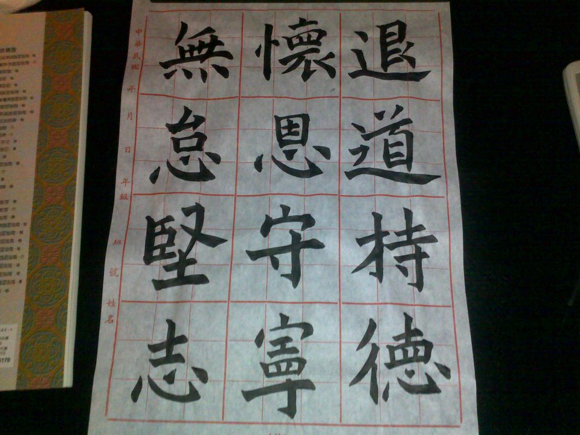

許多人會研究業務成功或失敗的是否有共通因素，包括個人特質、創意、經驗、臨床知識等等。但是就我看人，我只看兩樣：一是**熱忱**，二是**紀律性**。沒有熱忱的業務不能用，但是熱忱會隨著業務的成熟而逐漸消退，所以更重要的就是紀律性。我看過木訥不善交際的業務、專業度不夠的業務、臨床糟透的業務，他們卻都當過 top sales，而他們唯一的共同點就是**紀律性。**

## **熱忱、紀律、善用時間**

醫療業務的時間，說好聽是非常彈性，但也可說是從不下班。然而不能否認的是，我們在醫院或工作時間中往往有許多閒置時間。比如開車移動或等診，雖然我們無法消滅這些時間，但是重要的觀念是善用這些時間做一些事務性工作，以及避免這些時間影響你在客戶端真正重要的事情。 身為一個業務，工作內容可能包括與醫師討論、跟刀、解決護士或助理的問題、送貨、標案、議價、開發新客戶、文書等等，可說是琳瑯滿目，而每個工作崗位與各公司要求都不同。所以很難定論"什麼是最重要的事情"，然而身處其中的你一定要有能力區分出各個工作的重要性。 其次，區分出各個工作的重要性後，身為一個業務更要妥善檢視它們的時間性。比如說上下診、跟刀、標案通常具有較高的重要性與時間性 (急迫或無法更改時間)，必須優先處理。相對的，新客戶開發、送貨、文書處理等工作則較不具時間性或高度重要性，因此可以利用閒散時間伺機運作。 檢視完工作內容的重要性與時間性後，你應該可以列出你一週的時間表，把重要並確定占用時間的時段框住，然後制定你的開車移動計畫，最後再利用其中的閒散時間，鎖定你尚未開發的客戶來拜訪。

**Tip! 開車移動計畫小訣竅**：

關於開車移動，每個人有不同的喜好與習慣，但我的經驗是首先鎖定最遠的醫院並在最早的時間到達，然後慢慢回到市區，如此便可以在下午留下些閒散時間用以開發新客戶或是回家休息，有些人則喜歡先拜訪鄰近的醫院，好處是不必如此早起，但是缺點是往往回程遇上下班車潮，這是個人選擇了。

### 

## **總之，執行業務紀律性大原則有幾個：**

**第一**：確認高產值的工作內容並預先規劃時間給它。**第二**：妥善運用閒散時間，將同一醫院的行政與公關工作當天一次完成，避免再次浪費時間在開車移動上。**第三**：移動與文書時間不要占用黃金拜訪時間。 長此下來，成功的業務會發現他與客戶的作息慢慢重合，不必刻意尋找客戶而是客戶會自然地出現在你的行程中 (畢竟我們的客戶也是高度紀律性的一群人)，你便會有更多閒散時間開發新客戶或是自遊運用的時間，而當新客戶多到無法覆蓋時那便要對你說聲"恭喜"，因為那就是你準備好晉升的時候了!!

## **身為業務人員的我對工作有六大原則與基本態度**

* **退道**：未思進，先思退。在安排行程、訂立承諾、甚至溝通數字時，永遠給自己一條退路，不要讓自己前進不得，作任何事，先幫自己想好脫身之道。
* **持德**：必須以良心經營，以正道獲取正當利潤。作任何事情，先考慮到病人權益，再考慮客戶權益，接著考慮自己團隊的權益，然後你自己也必得權益。
* **懷恩**：常懷感謝心。感謝在每個小小關卡幫助你的人事物、感謝他們所作的，並且想想自己是否能為他們做些甚麼。
* **守寧**：低調，甘於寂寞。成為明星業務是幸運的，卻也是高風險的，況且業務的第二階段人生規劃靠的往往不只是業務能力，因此低調的表現，並培養全方位能力反而會有更大的成就。
* **無怠**：永不懈怠，堅守業務的紀律性，無論風雨、無論環境，堅持作每件小小的對的事情，抗拒小小的壞的誘惑，成功必將來臨。
* **堅志**：堅定志向、堅守信念，不管別人如何說、不管現時如何困難，相信自己所認定的，貫徹的執行
