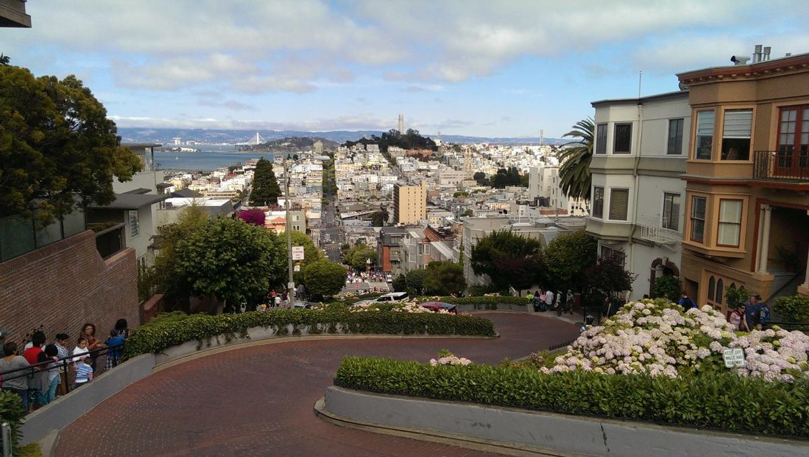

### **博士班出國實習？！**

都念到博士了還要出國實習？！未來職涯規劃的問題一直是現在屆臨畢業、即將要步入職場的博士們的大哉問。剛好前些時候很夯的電影高年級實習生 (The Intern) 反映了這個現象，勞伯 (Robert De Niro) 精彩詮釋了一個固執、存在於自我框架內許久的人生高年級生，整體描寫也很適用一個待在象牙塔內不食人間煙火多年的高學歷學生。在這部電影之前，我除了自己很瞭解的學術界之外，產業界是我一直很想去探索的，這次很恰好是一間新創藥廠提供的機會，也讓我在畢業前有不一樣的職場工作體驗。也透過這次實習，找出了屬於自己的答案，讓原本模糊的未來道路得以看見真正的方向。

### **知己知彼**

因為自己平常就有在為畢業後的求職鋪路，所以履歷一直都有持續修改，當時 Eureka Therapeutics, Inc. 提供學校這一個千載難逢的實習機會，想說就放膽去嘗試，看自己到目前累積的實力夠不夠在國際舞台上立足。我再把履歷去蕪存菁，強調人格特質、專業技能、溝通協調能力，抱著姑且一試的心態參加遴選，很榮幸能被選上。感謝校方幫我們做了很多沙盤推演，包括海外生活注意事項、公司職場倫理等等，讓我們做足心理準備。我也從各新聞稿和公司官方網站以及 LinkedIn 方面徹底瞭解這間公司的背景和研發方向以及成立宗旨各種資訊，期望自己到時候可以快速融入公司，在短時間內盡力吸收學習。

從著名的九曲花街 (Lombard Street) 往舊金山灣看去

### 

### **行前準備**

接到錄取通知後有更多的行前工作得準備：住宿、交通、行李、通關資料…等等。因為公司位於舊金山東部灣區，所以我們選擇了 UC Berkeley 附近有些學生釋出的空房，因為是暑假期間，選擇不少，不過還是得花時間好好篩選；交通方面因為灣區人口密度高，大眾運輸非常方便，除了一般捷運系統 (BART) 還有班次密集的公車 (AC Transit) 可以往來舊金山到奧克蘭，所以我們選擇用月票搭公車，較方便且便宜。還有很重要的食物，美國的外食相對台灣是比較貴的，這也是我們選擇住宿的考量之一：有廚房可以自己煮，雖然麻煩了點，不過可以節省很多開銷，而且去市場買菜也是個絕佳學習英文的好機會，藉此機會開發烹飪的技能對以後外出工作也有很大的幫助。

### 

Eureka Therapeutics, Inc. 各種藥物的研發進程，其中在2016年會有針對肝癌的藥物進入臨床人體實驗

### **實習經歷**

Eureka (也稱 Heureka) 一詞來自於古希臘哲學家阿基米德發現物體浮力等於被排開的水重時，跳出浴缸所說的話，意思為「我發現了！」。公司在 2006 年創立，其研發一路以來持續專注於癌症免疫治療上，呼應公司名稱，他們發明了創新的方法來針對之前無法被藥物鎖定的致癌基因 (oncogene)，利用此策略開發癌症新藥。公司位於全美生技最蓬勃發展的舊金山灣區，開始上班後，公司給我們簽暑了保密條約，經由主管的介紹才知道一間公司的成立和營運是如此不容易，所以許多內部資訊是他們的最高機密，對 Eureka Therapeutics 這樣的生技新創公司來說更是如此。不像大公司人手充沛，新創公司需要一人分飾多角，另一方面也可以讓員工學習許多不同面向的技能，例如邊做研究還要邊發新聞稿或邊找合作夥伴，這也是為什麼許多有野心的人選擇先投入新創公司，可以讓自己在短時間內快速成長，縮短達到自己理想的時間。因為我對藥廠和學術界的差異很有興趣，其中一位主管就用他每天的工作情況和我說明：在學術界作研究是你可以自己一直做實驗鮮少被干擾，但是在業界你必須隨時處理同事的緊急問題，所以在業界必須要反應更快，不只面對同事還有客戶的需求。另一點：在實驗室可能就是跟老闆討論研究進度就夠了，可是在公司必須每天早上或下午都跟不同部門的人開會討論溝通，務必確保對開發方向都有共識且充分瞭解營運情況。

起先我們到各部門輪調，負責各部門交辦的例行公事和各種雜項，舉凡滅菌、收垃圾到收件以及幫印表機更換墨水，哪裡需要我們就在哪裡出現。而各個部門都有研究人員鉅細靡遺地介紹實驗原理和各項營運服務，也讓我們練習操作來實際瞭解他們工作的進行和學術界有什麼不同。真的在業界速度就是一切，所以實驗耗材或設備都是以節省時間為前提來決定是否購買，比較不像在學校會有經費上的考量。在一個月的輪調後，第二個月就由專案經理幫我們設計了一個專案：利用學到的技術進行新的投藥標的篩選。因為時間緊迫我們就一邊搜尋文獻一邊開始做實驗，同時還得負責各部門的事務，真的是非常充實的暑假。在這期間很榮幸公司也邀請我在一個所有員工都在的時段分享我的研究內容，在會後的發問中，CEO 劉誠先生果不其然地提問是否可將我的研究應用到臨床開發上，很明顯的看出藥廠注重的是偏向臨床和應用開發的部分，這也讓平常做基礎研究的我好好的上了一課，去深思如何將自己的研究和臨床開發結合。

公司用人非常國際化，在同一個屋簷下和日本、中國、西班牙、美國以及台灣人共事是很難得的經驗，去理解文化差異的重要性，就知道尊重和瞭解是與他們相處的不二法門，當然他們也就不會拒我們於千里之外。我們也在空閒之餘藉由跟各位同事閒聊更進一步學習公司如何成長和解決問題的方法，這些都是書本上學不到的東西。因為公司聘請的大都是有博士學位的研究人員，這和台灣公司非常的不同，他們希望員工解決問題的能力可以充分發揮，雖然大家一起討論是必要的，但是很多難題必須自己克服，這方面也更印證了我在博士期間學到最重要的就是有獨當一面解決各種問題的能力。同時因為大家都是博士，比較不會有階級之分，所以討論事情完全是以問題狀況為前提，沒有一定誰說了算，這種開明且理性的溝通協調氣氛讓我印象深刻。公司創辦人劉誠先生集合了許多成功創業家的特質於一身：**敢冒險、熱情、深思熟慮、與團隊並肩作戰**，在幾次與他的交談中可以發現，他對於癌症免疫療法這個目標是非常有信心且堅持的，然而運作的過程是需要充滿彈性且因時因地制宜，才能在充滿變數的環境中存活下來。

### **心得感想**

在工作過程中我也學習到該有的工作倫理和態度，主動積極是必要的，平常的言談和行動也要保持活力和對公司事務的關注，而且很多雜務主動幫忙會收到很好的效果，讓同事和上司對自己加分，所以不要說很多事情事不關己就不去行動，很多時候這就是表現自己積極度的一刻。另一方面，多多觀察和提問，一定可以學到很多平常不會出現在公司表面的事情，尤其很多同事都很有內涵和實力，多與他們攀談讓我更加拓展人脈關係也聽到很多關於美國當地生活的佚事，這對於以後不管是在美國或台灣工作都很有幫助。

此行我也想去印證一件事：一定得出國才能做這些事嗎？在台灣就不能有他們的眼界和宏觀嗎？近年來台灣真的太悶，安分守己已經無法面對世界接踵而來的挑戰，雖然有人會說台灣就是小沒有辦法，但是心態是自己養成的，自己看扁自己或是整天怨聲載道，那什麼事情都不會改變。這兩個月我的感覺就像把一隻從小到大關在籠子裡的寵物，放到大自然中，牠真正接觸到草地，在大自然裡呼吸，雖然要離開籠子會有些許害怕，但是對於未知的挑戰還是躍躍欲試且興奮無比。籠子就是我們的舒適圈，離開舒適圈難免擔憂，不過這些都比不上對外面世界的渴望，去見識這個從來只有在書本和網路上才能一窺一二的世界。我也認知到還有很多事情值得我們去關注，而不是成天去計較很多芝麻蒜皮的小事，很多體悟讓我的視野更開闊，知道可以用更全面且更廣泛的思維去看待每件事，這些經驗很難用三言兩語描述清楚，都是在潛移默化之間慢慢且深刻地改變我。

台灣現在很流行打工度假或是短期實習，我也覺得真的是要離開家鄉，遠離自己平常熟悉的一切，才會真誠地跟自己的內心對話，發現自己想要的是什麼；不管之後是選擇謹守本分過日子，或是出來闖蕩一番事業，只要是認真過生活都應該被肯定。除此之外，藉由這種實習機會，自己需要去經營每一天，學習如何從無到有的過生活，一邊上班還得適應不同環境和文化；讓我明白從小就是身在福中不知福，日後在對待任何事和人都會懷抱感恩和知足的心，而且也透過和各式各樣的人相處，學習更圓融地去處理事情。我也很高興能把我在博士班的所學應用在公司裡：實事求是地解決問題、凡事講求證據、理性且平等地溝通，各方面都讓我明白公司可以穩定且快速地成長絕不是靠揠苗助長就會有效果，紮實的基礎知識和面面俱到的軟實力才是不可或缺。

**To be or not to be, it’s a question. 太多人在猶豫之間就錯過了機會，只能以後再來後悔當初，所以 Just do it！這次實習有太多經驗徹頭徹尾震撼了我，也有很多人讓我佩服不已，不過只要從現在開始永遠不會晚，不要小看自己再加上持之以恆努力，未來的挑戰都不足為懼。**
