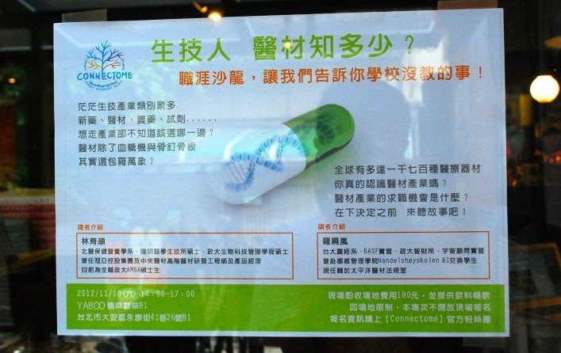
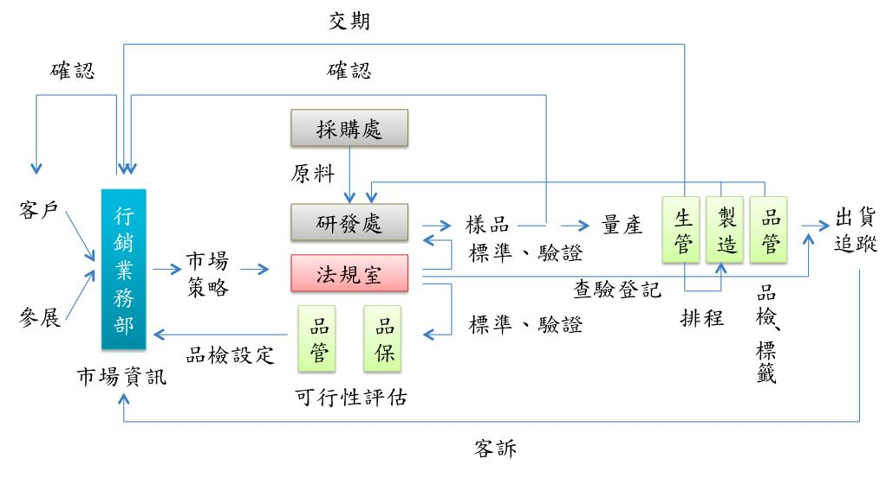

笑稱自己「根本是來亂的、看似[跨領域](/topic/學習與跨領域/)跨很兇，著實處處佔人名額！」

 

曉嵐學姊開場投影片上秀出自己的學經歷，簡介自己一路摸索的歷程：從台大農經系畢業、化工業實習、政大智財所研究、顧問業實習、挪威管理學院交換學生，到現在任職於太平洋醫材法規室。一切看似不相關，但是現在回頭看這些點都串起來了。（聽到這裡，我想起2005 年賈柏斯在 Stanford 給的那場[演講](http://www.youtube.com/watch?v=D1R-jKKp3NA "Steve Jobs Stanford Commencement Speech")，分享給大學畢業生他 Connecting the Dots 的故事。）學姊說，時間長了之後你回頭看自己過去做過的種種決定，人生中幾個重要的點會自然連起來。過去的事實都有其價值，只要好好把握當下，扮演好當下的角色，多嘗試絕對不會是在虛度光陰。經過了各種不同的嘗試，學姊體認到，學歷只是門檻，出了社會後的學習才是關鍵。

**要怎麼找到適合自己的產業？**

學姊給大家三個詞：「勇敢、主動、超越界限」。學姊舉自己去化工公司實習的經驗作例子：當初公司開出的徵選條件普遍是化工背景的職缺，農學背景的學姊秉持著不給自己設限的心態，憑著一股熱情，主動與公司接洽、投履歷，勇敢表達自己所長與興趣，讓公司了解自己，最後終於得到實習的機會。「**不要因為覺得某個產業跟自己沒有關係就給自己劃一大堆界限！只有勇敢跨越界限、多嘗試才能夠知道自己適合什麼樣的產業。**」

## **什麼是醫療器材？**

鞋子、襪子算不算[醫療器材](/industry/醫材/)？藥事法 13 條中定義，「醫療器材係包括診斷、治療、減輕或直接預防人類疾病，或足以影響人類身體結構及機能之儀器、器械、用具及其附件、配件、零件。」例如，能夠矯正走路姿勢的矯正涼鞋、能夠預防靜脈曲張的襪子，這些都是屬於醫療器材。

## **太平洋醫材**

太平洋醫材是目前台灣最大的醫療器材製造廠。成立於1977 年，總部在台北北投，苗栗有四座工廠。員工總數約 500 人。公司主要為歐日大廠品牌代工，亦有以自有品牌的型態在市面販售。公司內部人員組織架構如下圖。工廠包含作業員約430人，台北則有約70 人。學姊在職的法規室直屬董事長管轄，公司之研發處設於台北，隸屬於生產管理部門下。太平洋醫材的業務可分成醫用耗材以及醫建工程兩大類。醫用耗材為現階段公司主力品項，共有 125 種產品，包含各式管類、瓶類、袋類、傷口引流類以及手術抽吸類；醫建工程則有 62 種產品，分屬出口類、儀表類、工程設備等類別。約兩百種產品又依長度、接頭、氣源等不同規格來分類，等於總共有上千種產品！學姊開玩笑說，「在太平洋醫材的法規室工作，你一定不會無聊的！ 」

### **太平洋醫材1**

## **產品從**「**提案**」**到**「**出貨**」**的過程**

因太平洋醫材以代工為主，產品的需求來源主要為客戶。另一個來源是參展後得到的新想法、新概念，例如國際間公認最大的醫療器材展 - 德國杜塞道夫醫療器材展（MEDICA），每年公司在參展時都可以由對外行銷[業務](/job_function/業務代表/)帶回醫材新知或是新產品的市場資訊等。公司內部接到產品開發提案後會先擬定市場策略，例如預計販售國家，並初步清查該產品是否有合適的標準可供參照、該產品是否已有相關公告專利、是否需要進一步規避等細節而後進行規劃。 提案表一經上級許可，接下來就是公司各部門間的配合了。首先，研發需與製造單位配合以研擬製造方法並確定製造成本，確認產品可實現、成本在可接受範圍內，且避開所有專利權利範圍後，由業務向客戶、上級報價，經客戶或上級認可後，產品才進入試作階段。此時，法規與品保、研發單位需持續保持良好溝通，使產品符合各項標準規範（例如接頭顏色、管身強度等），其中若有公司內部無法檢驗、生產的部份需委外的情況，則法規需確認委外實驗室是否有相關認證、實驗生產過程是否符合標準規範、出來的品質是否符合要求等。品管單位在此階段則設定品檢要求、採樣級數等並與客戶做溝通。 等樣品正式出爐時，業務還需送樣給客戶做確認，待客戶確認符合品質要求後研發始能進行試產，在少批量的狀況下確認產品製程可行，最後才能正式移轉給工廠做大批量量產。此時法規需蒐集上述所有資訊，向欲販售的各國衛生主管單位申請進行查驗登記，並持續與主管單位溝通以取得許可證。 生產後還有一個醫療業相當重要的物件—「標籤」，，打上符合規定的標示後才能走到「出貨」這一步！但出貨後並不是功德圓滿了，還有許多重點步驟！此時業務單位負責蒐集客訴資料，法規部門則需進行上市後追蹤、不良反應通報等作業，並確定以上回饋確實導入生產環節而可以做進一步的改善。落落長的一段文字可見此流程之複雜、需要各部門間的往復溝通（整個架構可參考以下流程圖）。 

## **法規室的業務範圍**

法規室的業務主要是確保品質管理系統的一致性與產品的安全有效性。品質一致性的控管包含醫療器材相關的法規如 ISO 13485、ISO 14971、GMP 等都要熟知、定期做內部稽核、了解各國法規最新進展等，客戶或主管機關來稽核查廠時，法規人員也需陪同並適時進行應對。而產品驗證部份依流程可分為「**產品提案**」、「**試作試產量產**」以及「**出貨**」三階段來說：產品提案時首先要針對目標上市國家找尋適用標準，並與研發合作導入標準，同時需做專利檢索。若是有相關[專利](/job_function/智財管理/)，則該設法進行迴避；若沒有則可評估是否有申請專利的必要與價值。當產品到了試作試產量產階段時，法規人員要檢查生物相容性報告有無瑕疵、確認產品是否符合預期使用目的和先前設定要求、滅菌確效、包裝確效、軟體確效等，在蒐集完所有產品驗證資料後需向各國衛生主管機關進行查驗登記。另外，因專利不是在申請時馬上就會公開專利內容，故在整個產品開發的過程中需要持續進行專利監視。最後，有效期驗證、臨床試驗或臨床評估和上市後追蹤等都是法規室成員的工作。

## **太平洋醫材各部門之對口單位**

行銷業務部平時接洽對象為公司之客戶（如歐美大廠或各家醫院單位），另外，健保局亦是行銷業務部的對口（核價等作業）。各地衛生主管機關（如 FDA 等）、認證驗證單位（如 UL、SGS、Notify Body）、智慧局和專利事務所等皆是屬於法規室的接洽對象。採購及研發則是主要與原物料廠商（例如塑化材廠商）接洽。

**醫材產業需要什麼人才？**

太平洋醫材其實就是本質為製造業的生技業。儘管如此，各部門都需要不同專業的人才，像是法規室就有包含醫學、生化等領域人才；研發部門則需電機、機械人才；業務工作最需要的是善與人溝通的特質。舉凡生科、生技、醫學、智財、化學、材料、語言、商學、環境工程等各領域專才皆是公司需要的人才。說了那麼多仍要回到最初學姊提醒大家的，其實公司並沒有對新鮮人太多限制，大家一定要記得文憑只是參考，在工作崗位上的學習能力才是比較重要的。最後，對職場新鮮人，學姊給了幾條建議，「多聽多看少講話、做人比做事重要、切勿自視甚高、越是得意越要謙虛、機會來時好好表現、幫助別人就是幫助自己」。 這個下午的活動設計給活動參與者大家有許多認識彼此、分享心得的機會。除了醫材相關知識，我們其實學到了更多職場祕訣。沒有人限制你的時候，千萬不要畫地自限了，就勇敢跨出去吧！

- 本篇為羅曉嵐在 Connectome 11月10日「生技人，醫材知多少」職涯沙龍的分享整理- 

羅曉嵐 簡介

台大農經系畢業、BASF化工業實習、政大智財所研究、宇智顧問業實習、挪威Handelshøyskolen BI管理學院交換學生，現任職於太平洋醫材法規室，是擁有多元背景的生技人，將乍看之下沒有關聯的領域經驗一點一點串接起來，走出一片天！

**[Connectionary](http://www.flickr.com/photos/97565412@N03/sets/72157634149166929/ "點我看更多生醫詞彙")相關詞彙介紹**

