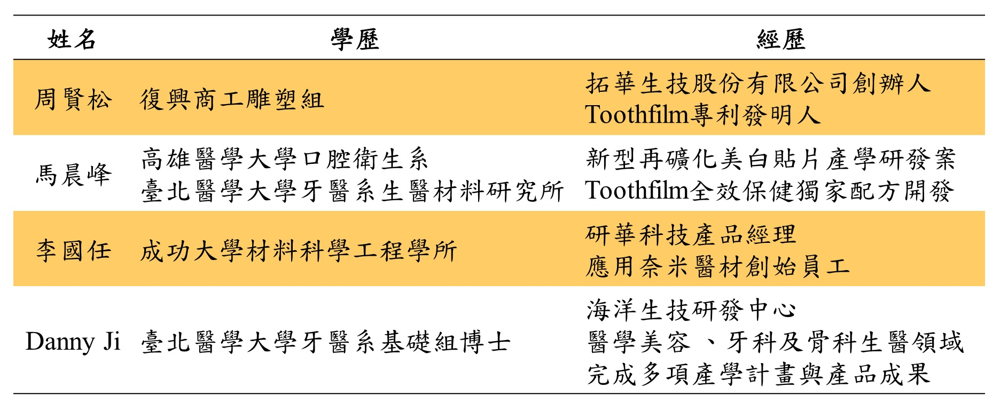
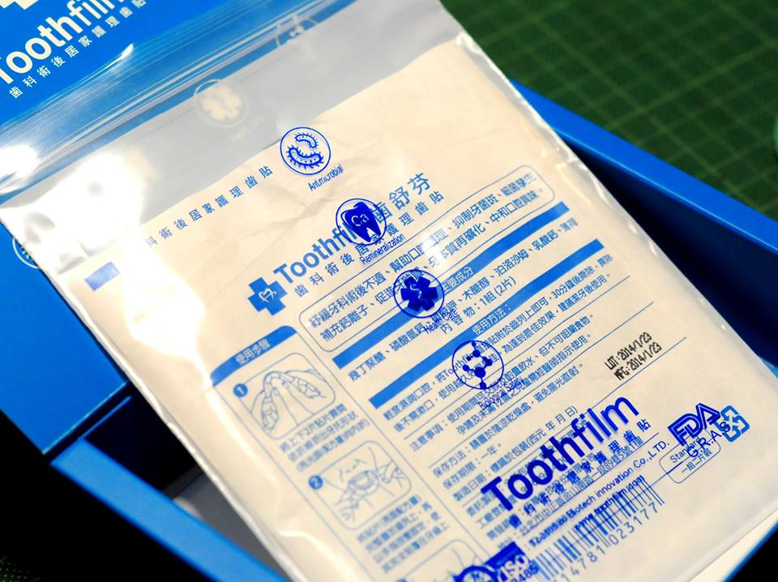
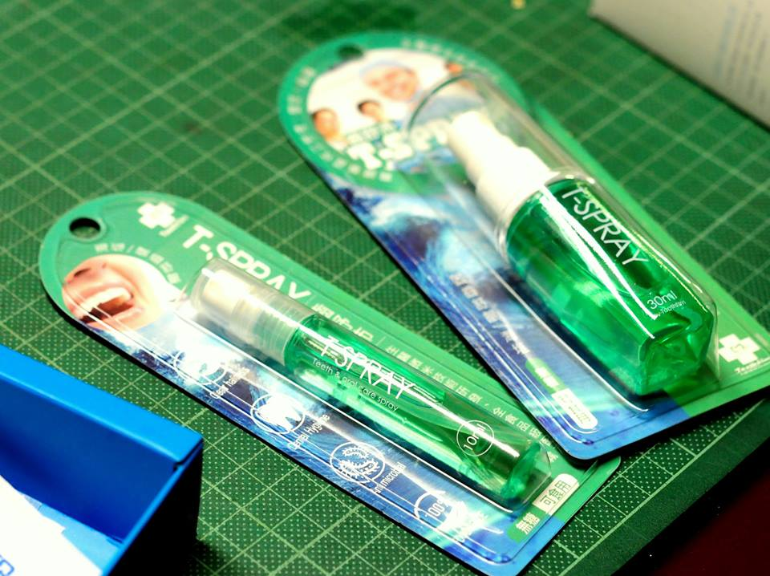

## ** 從點子創意到團隊創立 **

2012 年 6 月成立的[拓華生技股份有限公司（Toothfilm Biotech Innovation Co., Ltd.）](http://toothfilm.shop.rakuten.tw/info/)，是臺灣一間著重於口腔清潔與保健的生技類新創公司。令人讚嘆的是，在公司創立的背後其實有個特別的故事，創辦人周賢松起初是從事廣告行銷業務，有感於市面上缺乏可隨身維持口腔衛生之產品，加上自身一直有創業的念頭與想做商品的理想，又期許自己做別人沒做過的東西，因此臨機一動構想出「紙牙膏」的概念，希望創造出**一套能貼在牙齒上且具保健成分的新型態口腔保健模式**。為了將紙牙膏的想法實際變成實體商品，在找尋技術合作夥伴過程中，結識當時於臺北醫學大學牙醫系基礎組就讀博士班的吳宏達，進一步將紙牙膏的概念逐步實現，爾後又經由宏達介紹，和同實驗室就讀碩士班的馬晨峰組成創業團隊。周賢松提到創業團隊成員的組成往往最主要是因理念相同而結合（如表一所示），負責整體執行及廣告行銷的周賢松、技術研發及產品設計專長的馬晨峰、掌管公司營運、導入量產、與內外合作專案進度的李國任、以及研擬商化與市場行銷策略的 Danny Ji，在責任分工上相當明確也因此能為同一目標相互扶持；另外，隨著公司經營規劃與成長也於 2014 年陸續延攬了經驗豐富的研發兼量產管理、行銷業務、會計兼業務管理等夥伴。

表一、拓華生技成員背景經歷 .

## ** 顛覆傳統的產品發想及設計思維 **

 齒舒芬（Toothfilm）

        生活中常見的口腔保健方式不外乎以刷牙及漱口為主，但其實仍有許多問題存在，如牙周病、化療病患及糖尿病等慢性病人、老人的不便使用。周賢松強調，如果要改善別人無法改善的問題，產品就不能被舊有刷牙漱口的思維所限制，因而發想出「紙牙膏」的新概念。另一方面，馬晨峰於碩士班研究之重點為牙齒的再礦化（Remineralization），利用磷酸鈣的再結晶技術來修補並強化牙齒。在現階段的口腔醫美療程中，有非常多的消費者反應牙齒美白之後，往往會造成牙齒的嚴重損傷，**術後需要再以修復貼片保護牙齒使其復原**，正因為看見美白後修復此塊上下游的市場需求，若團隊在劑型上改以貼片的形式使用，並在貼片上增添其他修復配方，將可大幅突顯其在作用時效比牙膏持久之優勢。由於市面貼片主要是 2D 平面化結構，僅能覆蓋前排牙齒，周賢松發想何不設計成 3D 立體化的全口貼片，於是找上原本廣告業的舊識紙藝大師洪新富，利用摺紙的概念設計出首款能符合需求的 3D 全口貼片。因此，為了減輕生產上的困難，同時又能提升保健上的效果，在周賢松針對清潔導向的紙牙膏與牙托設計概念、馬晨峰以保健導向的配方劑型技術、加上李國任在商品化、導入量產經驗，三個元素的相互激盪之下，產品逐漸改良並發展成全球第一片口腔保健牙齒貼片—「齒舒芬TM（ToothfilmTM）」。此款全口貼片具有活性配方 IPC 晶球以及 CRP 貼片製造等技術重點，也已在臺灣及美國進行核心專利申請，功能訴求即是方便清潔及保養牙齒。

.

## ** 用專業逐步建構自我品牌價值 **

        在公司定位與產品行銷的決策過程中，拓華團隊也積極向各方專家請教及商討相關意見，在一開始進行產品開發時，最早找上的是[紡織產業綜合研究所（TTRI）](http://www.ttri.org.tw/)，屬於獨資的研發作業。之後高雄義守大學教授建議，此產品應往醫材類二級方向發展、陽明牙醫學院院長則推薦，應專注開發老年或重症患者的口腔保健市場。近期公司的營運規劃將以研發產品為主，同時會依消費群眾的不同，分階段主攻各分眾市場，如老年疾病照護（口腔黏膜受損嚴重、無法自行操作、咀嚼）、女性牙齒美容或寵物潔牙。主要是**產品開發到代工量產**這部分需要較多的時間與較重的比例進行，原因在於各代工廠的製程條件不一，必須回實驗室重新試作配方，馬晨峰也提及試製作過程十分不易，材質及敷料的試用、製作條件的尋找、等待工廠生產線的空檔等等，皆須符合條件後才能開始委託製造；因此，若能找到一間理念相同、可相互支援的代工廠，將可為團隊節省不少研發試作時間與費用。

 齒舒沛（T-Spray）

        在公司定位方面，由於目前牙醫產業除了傳統齒科治療用的手術醫材、局部貼片外，多半都轉型成醫學美容服務；然而，後續卻很少有針對刷牙後保養，甚至是治療後保養的口腔衛生產品，故團隊期望將產品發展導向為銜接術後保養的方向，扮演成一類似**口衛健康照護醫師**的角色提供消費者完善的口腔保健服務；因此，Toothfilm 全口貼片的開發正積極和醫院單位合作進行臨床測試。除了原先的牙齒貼片外，團隊發現民眾對於口腔衛生噴劑市場的接受度頗高，故目前也主力研發護齒口腔噴劑產品—「[齒舒沛TM（T-SprayTM）](http://toothfilm.shop.rakuten.tw/)」，具有活性配方 IPC 晶球以及全食品級成分配方製成兩大技術重點，不僅能達到除口臭的芳香目的，也能有飯後清潔保健、治療初期嘴破、初期齒齦出血或腫痛、除口臭的功效，期望成為口腔保健界的小護士。

        在產品行銷方面，因為產品一開始就有明確的功能定向—「**清潔**，**美白**，**保健**」，因此團隊的行銷策略也有特別手法，馬晨峰將牙齒貼片比喻成消費者熟知的面膜，透過兩者都是以保養為訴求的相似產品，再來強調貼片可視為一般刷牙清潔功效的搭配甚至加成品，並非單純是刷牙清潔的取代品。另外，團隊相當注重**使用者經驗**，但這也是團隊目前所需面臨的考驗，一般而言，消費者難免會對一項前所未見的新產品感到陌生、疑慮，因此，團隊很實際地以配戴隱形眼鏡為例進行教育推廣，透過頻繁的接觸時間使顧客逐漸熟悉進而接受。換句話說，公司在產品走向之設定期望以減少改變使用者習慣為原則，同時嚴格選取無毒材料讓消費者能安心使用。近期也建立「齒妍堂（i-D Shop）」之口衛 3.0 網路通路品牌，專注販售及推廣含保健與清潔的口腔保養品。

## ****堅持是不斷創新的原動力****

        拓華生技從起初的獨立資金到未來的國發創業基金申請或開放外部天使或創投投資，對每一筆金額的運用皆有縝密的控管機制，其中對產品的價格制訂更是一大學問，考慮因素包含製造成本、競爭者參考價格。由於專業市場通常優先有制價權，當團隊在牙醫專業市場站穩後，再發散至具潛在力、可透過教育推廣的大眾市場。為了讓產品持續有加價的空間，必須要不斷提升產品自身價值，因此，團隊將具有突破性的全口貼片申請核心專利，配方則列為營業秘密，配合產品發展進行佈局以保護產品進而提升價值。同時，透過牙科診所、醫療展場、網路購物平台等媒介，積極建立行銷管道及增加市場能見度。

        當團隊被問到成立「生技類」新創公司所需預先設想的問題以及建議時，也都以過來人的立場慷慨且精闢地分享個人見解，周賢松認為對於產品商業化的策略應先注重在法規、專利等面向的佈局以保護產品；在製程上必須設想未來量產階段要如何與工廠溝通、進行技術條件的調整等等，重要的是應將廠商視為共同夥伴。Danny Ji 則強調看見顧客與市場的需求、一次到位或是分階段的經營規劃，以及資金、人才的拓展都要有完整的長期營運機制。馬晨峰提到公司定位是營運發展的重要關鍵，確立公司在口腔保健的定位、專注既定的產品類型才能不失焦地打響自己的品牌。採訪團隊從拓華生技在創業一路走來所面臨的挑戰以及所得到的啟發中，都能看見每個人對自家產品的堅持與突破傳統的創新，他們一直努力地為臺灣生技產業口腔保健領域展露無限光芒。

 拓華生技股份有限公司 創辦團隊：周賢松、馬晨峰、李國任、Danny Ji
