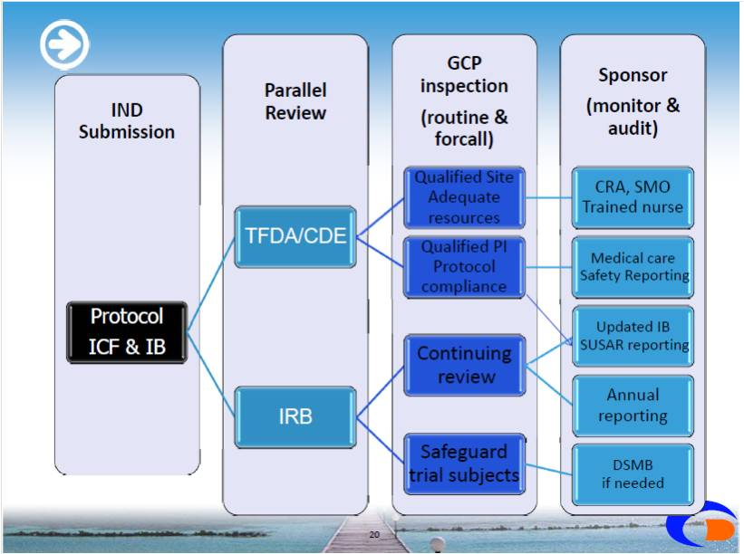
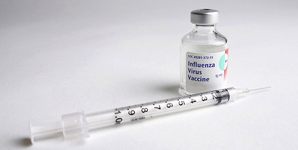

臨床試驗是新藥研發的重要一環，而相關職缺更是許多畢業新鮮人的熱門選擇，然而如同導言所提及的，臺灣臨床試驗產業經過多年的發展，雖有進步但仍有許多值得改進的空間，以下為 Connectome 整理產業先進 chairman (ID) 對臺灣臨床試驗的現況，以及針對兩岸醫藥衛生合作協議等議題的探討，期待讀者能對此一領域有更深入的了解。

##  臺灣臨床試驗的現況： 篳路藍縷，一路艱辛  

**** 

圖片來源：醫藥品查驗中心戴天慈醫師2012年5月27日演講：臺灣醫藥品臨床試驗現況(註1)。此圖僅供讀者簡單了解臨床試驗申請與執行流程。

臨床試驗的申請流程，一般分為 RA (Regulatory Authority，衛生主管機關) 核准以及臨床試驗執行醫院之 IRB (Institutional Review Board，一般稱倫理委員會) 的核准兩個部份。臺灣開始加入跨國臨床試驗近 20 年來，初期衛生主管機關的審查仍然以實質審查為主，也就是國內衛生署自行執行科學性以及倫理性的審查，對於 FDA 核准案件雖然有某些相關規定可以加速審查的流程，但實際上臨床試驗案件的審查時效性並沒有縮短多少。  

同時由於案件審查為**二元制** (由藥政處委託之 CDE 醫藥品查驗中心收案並進行初步審查，後由藥政處核決)，除了行政程序與溝通上的繁瑣以外，少數案例中亦曾經發生 CDE 專家審查意見與藥政處藥審會意見不一的狀況，凡此種種均導致臨床試驗申請及執行的延遲。對比在美國與日本執行臨床試驗，只要廠商把案子送到 FDA/PMDA (Pharmaceuticals and Medical Devices Agency，日本衛生主管機關厚生省下轄機關) 一定天數 (如FDA為30 個日曆天) 後沒有任何意見傳回給廠商的話，就視為自動同意試驗進行，而臨床試驗審查與執行主要透過醫院 IRB 來監控與管制，相較之下臺灣在這方面有很大的進步空間。  

而後直到 2005 年，前藥政處長廖繼洲上任後，藥政處才慢慢開始與國際接軌，並致力於縮短臨床試驗審查時程；到了 TFDA 在 2010 年掛牌成立，康照洲教授接任局長後，更於民國 99 年 8 月起施行『[多國多中心藥品臨床試驗計畫審查程序](http://www1.cde.org.tw/2011/epaper/RegMed/V2/RMV2p29-31.PDF "多國多中心臨床試驗計畫 CTN 審查程序之重要影響")』，並推行臨床試驗審查一元化的措施，至此對於跨國臨床試驗案而言，衛生主管機關的審查已從實質審查逐漸轉為形式審查，時效性也從原本的約 2 到 3 個月縮短到 2 到 3 周，若加計其他非多國多中心案件的話，目前臨床試驗審查的天數約為 40 天左右 (註2)。  

然而，儘管我們的衛生主管機關在縮短臨床試驗申請與執行的時效上做了許多努力，近年來由立法院推動的多項新政策與法律 (如人體試驗管理辦法、生物資料庫管理條例、新版個人資料保護法等等)，不但某些內容製造新的行政障礙，反國際趨勢而行，甚且有些還與目前法令互相矛盾/扞格；再加上近年來許多醫院因民粹意識高漲，醫療糾紛盛行與繁瑣的法規影響而視臨床試驗為洪水猛獸，限制越來越多，醫院端的審核時間近年來不減反增，拖到半年以上甚至到一年以上還沒辦法正式開始進行的案例比比皆是，凡此種種，真的很難讓人對臺灣臨床試驗的未來存有樂觀的期望。

## **不**健全 / 不友善的臨床試驗環境：低落的效率與媒體的負面效應 

臨床試驗在醫院執行，通常首先須要向倫理委員會提出申請。在臺灣剛開始加入跨國臨床試驗時，由於大部分醫院對於臨床試驗案審查經驗不足，因此有志之士在 1997 年聯合國內數家醫學中心與教學醫院成立了**聯合人體試驗委員會** (Joint IRB，註3)，負責代替試驗執行醫院審核臨床試驗，並代送衛生署核備。這個機制在開始時十分成功，除了委員會的審查品質有目共睹之外，委託審查的醫院也多能尊重 JIRB 的審查結果，在 JIRB 核准之後不額外要求補充資料或行政流程。  

然而最近幾年，隨著各醫院對臨床試驗風險意識的高漲，加上衛生署開始推行醫院 IRB 認證且更加重視醫院倫理委員會對臨床試驗案的管控，臺灣開始進入了臨床試驗審查的陣痛期 — 即使 JIRB 審查通過，多數醫院仍會進行重複審查 (稱之為 **『追認』審查**)，而大部分的追認審查都會提出 JIRB 審查時未提出的問題與意見，導致廠商與試驗主持人必須花費雙倍的時間跟精力去回覆這些意見；甚至這兩年已開始有一些醫學中心再也不接受 JIRB 的審查結果。因此，即使是 JIRB 審查通過案件，廠商與試驗主持人仍必須經歷大部分的醫院行政與審查流程，當初設立 JIRB的 美意幾乎已蕩然無存。  

而醫院內部的IRB審查也常因審查委員過於忙碌或是審查經驗不足而導致整個審核流程延遲，加上其他繁雜的行政程序 (比如許多醫院試驗執行的醫療科部或是臨床試驗中心常會要求額外的書面資料/申請公文，多數醫院的藥局也常要求額外的藥品相關資料說明與表格) 與臨床試驗合約的眾多不合理要求，導致目前臺灣臨床試驗在醫院的核准時程已淪為國際後段班標準 (一般來說，在歐洲與亞洲3到6個月是合理的估計，平均核准時間超過半年以上的國家基本上都被視為行政效率低落)。  

**臨床試驗審查的重點不是省略/免除行政流程，而是有效率且標準化、透明化，可受公評的嚴格審查。** 舉例來說，當國外很多醫院的臨床研究中心提供標準的 one stop service 時，臺灣卻還需要先送倫理委員會，再遞送合約草案給管理部及律師 (某些醫院還要求須倫理委員會通過才可審合約)，然後再送藥劑部、醫療科部…等等，這些繁文縟節不僅增加主持人與CRA 的工作量，更直接的拖延了臨床試驗進行的時程。許多醫院即使有臨床試驗案審查的標準作業流程，也絕大多數缺乏清楚明確的時效性規定，時常因為人為因素造成延遲；合約可以因為承辦人離職或是醫院委託的律師換人而全部重審，同一家醫院的不同分院對同一份合約也可能會有截然不同的見解，甚至有要求重審的案例發生。大部分的醫院不認為跟試驗委託廠商或 CRO 之間是夥伴關係而是主從關係，許多的醫界大老們也總是認為廠商會為了市場考量而排隊求他們做臨床試驗，因此對於試驗審查的時效性並不在意，某些醫院對於試驗傷害的責任賠償甚至設下一些不平等條款 (比如非試驗相關之的傷害與損失，仍要求廠商賠償)，廠商只能選擇接受或打退堂鼓。  

此外，當國外已有許多醫院的電子病歷已符合 [CFR 21 Part 11](http://www.sensitech.com.tw/info/info01.html "FDA 21 CFR Part 11 是什麼？") (註4)的標準，臺灣的臨床試驗還在因為許多醫院實施電子病歷而變成必須一定要額外印出紙本才能符合國際規範 (事實上許多臺灣醫院的電子病歷系統甚至不符合醫療法的規定)，當國外許多的試驗中心團隊都已建立起良好的人員訓練管理模式，臺灣的 CRA 還需要額外花時間幫試驗主持人訓練研究護士，處理各種因為語言障礙而導致的問題，甚至幫試驗主持人準備通報新藥臨床試驗嚴重不良事件 (Serious Adverse Event, SAE) 的表格，這些臨床試驗或是醫療環境的不健全，也都是造成臺灣臨床試驗產業發展停滯的原因。  

當然不是說其他的國家就完全沒有這樣的問題，但在這個國與國之間競爭激烈的年代，沒有進步就等於是退步，**現在落後一年的差距，以後用十年都不見得能補得回來。** **先進國家把臨床試驗當產業，臺灣把臨床試驗當養白老鼠。** 在全世界公認臨床研究最先進的美國，政府和醫院確確實實地把臨床試驗當成一項產業在經營與規範。審核新藥非常嚴謹的 FDA，並不因為嚴格的審查而放棄了效率，現在許多亞洲國家也都在朝這個方向邁進。當世界各國都開始擁抱與歡迎經過嚴格審核的人體試驗，臺灣卻在民粹風潮與媒體的操弄之下，有許多民眾甚至連藥政處官員 (註5) 都把臨床試驗當成養白老鼠，長此以往，只怕最後受害的還是全民的健康福祉；新藥的延遲引進，甚至不引進國內等 (市場太小、健保給付又太低，跨國大藥廠乾脆直接放棄)情事，早已不是危言聳聽而是現在進行式，**民眾、產業界與醫界已是三輸。**  

臺灣民眾對於風險的極度趨避習性，近年來在媒體斷章取義式的嗜血報導之下，幾乎達到了最高峰，層出不窮的醫療糾紛，間接讓醫療人員對於有風險的臨床試驗更為戒慎恐懼；然而弔詭的是，民眾不容許牛肉裡含有極微量的瘦肉精，對於生鮮蔬果中常見的高量殘留農藥跟生活用品中無所不在的環境荷爾蒙，卻視而不見；人們要求在醫院拿到的藥必須沒有副作用，在醫院進行的任何手術必須要『零風險』，對於街頭巷尾流傳的民俗偏方與另類療法卻是趨之若鶩...  

試驗本身就是一種風險，但承擔風險的同時也獲得了更好治療的可能性。我們當然可以拒絕任何形式的風險 (怕車禍可以不出門，怕墜機可以不搭飛機，但即使待在家裡也不能保證零風險)，對一個拒絕臨床試驗的國家來說，的確，少部分人的風險被完全免除了 — 但大部分的民眾將承擔無法及時獲得最佳治療藥品的風險，這是臺灣民眾想要的嗎？ 在現行的醫療環境之下，臨床試驗在醫院經營者的眼中早已成為高風險低報酬的燙手山芋。當接近上市的第三期跨國臨床試驗尚且被視為洪水猛獸時，官員還夸夸其詞談著要讓臺灣變成早期臨床試驗中心的願景，這是何等諷刺！

## **對海峽兩岸醫藥衛生合作協議的看法**

雖然臺灣跟中國簽署了[海峽兩岸醫藥衛生合作協議]，但其實這協議內容很籠統，而天底下協議也沒有只有對方讓利自己不開放的，就像 ECFA 期待大陸一味讓利也只是一廂情願。

根據媒體的報導，過去兩年兩岸之間開了許多閉門會議但卻毫無具體成果，其實可以想見，因為協議裡有關標準規範協調的部分其實是很難達成的。中國的法規與臺灣藥政管理偏向學習美國 FDA 的法規落差極大，且中國衛生部藥物食品監管局 (SFDA) 對於臨床試驗的審批時效一向很長 (至少半年至一年左右)，在臨床研究合作的部分，就算大陸再怎麼讓利，也不太可能單獨為與臺灣合作的案件破格加速核准流程。而就新藥審查結果互相承認的部分，雖然目前還沒看到具體的做法，不過一旦開放，對臺灣業界的基層工作同仁基本上可說是**弊大於利**的。 舉例來說，如果今天美國 FDA 或日本 PMDA 無條件承認大陸執行的臨床試驗資料且無須額外的 local data， 這些跨國大藥廠會到哪裡執行臨床試驗？每個國家都會保護自己的產業，所以不可能無條件開放，而兩岸之間做這樣的相互承認對誰有好處？又是那些團體在大力推動？只要想一想，答案就很清楚了。  

一旦兩岸完全開放相互承認新藥上市審查的結果，按目前跨國大藥廠的策略，臺灣將變成大中華區 (中港澳臺) 的一個地區辦公室，不需要太多高階主管，而 CRA 人力自由流動的結果，臺灣人將面臨相對的劣勢 (薪資、語言、積極性等等問題)。 至於對整體產業的發展，政府開放的原意是希望更多臨床試驗在台進行，然而臺灣的醫院以及主持人是否已經準備好面臨對岸的競爭了？考量醫療成本、醫師費用、時效性、醫院的配合度，若真的開放相互承認，我想到對岸進行的臨床試驗將遠比到臺灣的多。  

短期內臺灣的臨床試驗產業將面臨邊緣化與空洞化的危機，長期而言，則要看政府與醫界如何重新找出臺灣臨床試驗的利基點，才有可能浴火重生。 曾經聽過前同事說她有個 Global Trial，大陸的 Site Initiation 竟然比臺灣還快，有在業界工作過的就知道，大陸 SFDA 的送審速度非常緩慢，然而一旦通過之後，醫院方面的配合度與收案速度都遠超過臺灣，所以這是一個很嚴重的警訊。最近連我自己手上的案子，這樣的狀況都即將真實上演，如果臺灣連行政效率都贏不了對岸，費用高昂，收案執行成效又不彰，我實在看不出來開放後臺灣的競爭力在哪裡。而不管到最後會開放多少，其實臺灣的籌碼都已經越來越少了，以往臺灣可以驕傲的說『臺灣在臨床試驗水準及人才都比大陸進步』，然而這樣的優勢與差距已經越來越小，若不大刀闊斧的改革，我想這些優勢也將很快變成昨日黃花、過眼雲煙了吧。

# 

## **跨國專案管理的心得**與 CRA 的未來發展機會 

回想以前在做 CRA 的時候，總是會覺得 global team 很不公平，所有的資源跟關愛眼神總是給了China 跟 India；因為環境的限制，臺灣的團隊不管再怎麼認真工作也得不到更多的重視。我永遠記得第一次做送審工作時的沮喪；為了趕時效性沒日沒夜地加班，終於在收到計畫書後一周之內，就完成了衛生署跟醫院 IRB 的送件工作。同一時間，韓國的同事好整以暇地等計畫書翻譯等了一個月，然後又花了兩個禮拜準備送審，但最後還是搶先一步比臺灣早拿到核准函。現在有機會接觸 global project management 之後，才了解到有限的資源本來就只能給最有 performance potential 的國家 ，雖然很殘酷，但這是現實。  

為了不再總是事倍功半、為了讓自己的努力能被看見，我開始想，必須要把腳步跨出臺灣，才有機會。這幾年來，換了公司跟職位，雖然不再直接擔任 CRA 的工作，但卻很幸運能有更多機會去了解歐美跟其他亞洲各國的臨床試驗是怎麼執行的；對於這個培育我成長的環境，我只能說近年來整個臺灣醫界還陶醉在自我感覺良好的氛圍中 (至少就臨床試驗而言是如此)；更多不合理而繁雜的法規、更多的行政障礙，血汗健保奇蹟造就的血汗醫療團隊，對於臨床試驗跟創新研究更是無心戀棧。

雖然臺灣這個環境有這麼多的困難與挑戰，但如果問我現在還適不適合投入這個業界當 CRA？我的答案還是肯定的，因為業界不缺人力，但永遠缺人才！ CRA 這個工作是一種學習，同時也是一種磨練，因為接觸的範圍廣，除了要能夠關注細微的小事，也要能夠看到大方向，還要有良好的溝通能力。能做好 CRA 這個工作，其他的職位也都會很容易上手，比如在藥廠，有一些行銷部門的人員其實是從 R&D 部門轉過去的，但是相對的從行銷部門轉過來的就很少。 所以，只要企圖心不是只在嘴巴上說說、抗壓性不是只放在心裡，別把自己的視野跟眼界侷限在臺灣這個小島，那麼揮灑空間還是很大的，比如中國大陸，目前就充滿了機會。然而不可否認的，每個市場都會成熟、會飽和，現在中國缺乏有經驗的專案經理，不代表明年、後年還會有缺。對於剛入行的同仁，我只能說，不要放棄任何可以累積不同經驗的機會；有接觸/學習其他國家臨床試驗執行的機會就要趕快把握，『世界是平的』已經不是口號，別的國家的人才也都在快速地成長，想要不被淘汰，放眼亞太是唯一的路。 如果環境不能改變，那麼我們只能改變自己。如果只想繼續守著臺灣，現在看來也許不會有甚麼立即的危險; **but you never know what will happen after 10 years.**  

**註1** ：醫藥品臨床試驗現況 (CDE 戴天慈醫師演講，2012 年 5 月 27 日)；http://tinyurl.com/8tv8z9u  

**註2**：臨床試驗審查天數 "本年[100年度]累計審查總件數205件，**平均審查天數40天**，結案件數43件，平均審查天數16天。" 以上來源自行政院衛生署 100年度施政績效報告。  

**註3**：聯合人體試驗委員會"為保障受試者之安全與權益，新藥臨床試驗必須經過各醫院人體試驗委員會 (Institutional Review Board, IRB) 審核通過，但是台灣致力爭取參加的第三期多中心臨床試驗，卻常因各醫院 IRB 開會時間不一，送件格式不同，給予不同修正意見，而失去時效，甚且無法共用一個臨床試驗計畫書。為解決上述困難，遂於八十六年由五大醫學中心及國家衛生院專家共組一聯合人體試驗委員會 (Joint IRB)，每月開會，快速嚴格審查，建立與委託者面對面溝通管道，至今已有 31 家醫院委託代審 (約佔國內執行臨床試驗三分之二機構)，收費雖高 (每案新台幣 12 萬元)，但成效卓著，使台灣在 IRB 議題上成為亞太典範。" 以上節錄自: http://tinyurl.com/92hnm4o  

**註4**：Code of Federal Regulations 21 Part 11 美國聯邦藥物與食品法規中有關電子記錄與簽章的規定。http://tinyurl.com/ybr5ov3 **註5**：全民皆為白老鼠 2004年5/24日時任衛生署藥政處長的王惠珀曾投書中國時報，就臨床試驗研究產業化的議題發表了[全民皆為白老鼠]的文章，反對政府政策傾向支持該產業。

# 

**延伸閱讀**:

當臨床試驗遇見電子病歷 <http://kelwww.cgmh-mi.com/nucltechblog/2012-08-10-EMR-and-clinical-trials>

兩岸醫藥協定空轉 <http://news.chinatimes.com/politics/50207048/122012062200139.html>

分享者：PTT Bioindustry 板友 Chairman，藥學系/臨床藥學所畢業，因為學習臨床藥學而對臨床試驗產生興趣，卻也因為台灣臨床環境的侷限性而選擇做了臨藥逃兵並加入產業界。曾於外商藥廠與CRO 擔任臨床研究專員、品管專員與臨床研究經理工作，目前於某外商 CRO 任職臨床研究主管，負責跨國臨床試驗案亞洲區專案管理工作。
