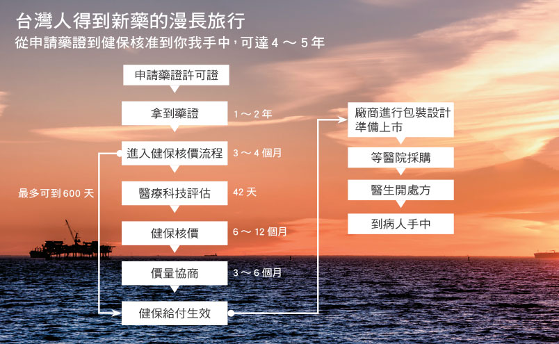
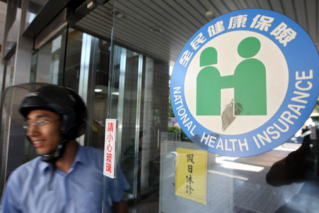

台灣藥價基準乃是參考全球十大已開發經濟國 (A10) 藥價的中位數作為支付價格上限，並在核價時將匯率變動、包裝大小納入考量。但實際上健保局所制定的藥價實是偏低，以專利新藥為例，其價格約為國際平均中位價的 65%，將藥價差納入考量後更只有 50%，而整體平均藥價與美國相比則僅為其 28%。

### **<span style="color:#993300">然而低廉的藥價並非只有好處，臺灣長期的低廉價格已影響了引進新藥的速度。 </span>**

```
 
<span style="color:#808080">圖片來源: 康健雜誌</span>
```

在引進新藥時，中央健保局需要約六個月的時間核定藥價，然由於其開價通常會遠低於 A10 的平均價，故大多數藥廠會再向健保局爭取調高價格，使得定價時間拉長到半年甚至一年，影響新藥在台灣的上市時間，加上新藥進口核准流程，使得台灣在引進新藥的速度上，約慢了三至四年。 由於偏低的藥價使得藥廠將新藥引進台灣的意願減低，尤其台灣的藥價近年來成為鄰近國家如韓國、泰國等的參考指標，為了避免這些國家以台灣偏低的藥價向藥廠議價，部分藥廠已開始選擇將新藥先引進其他國家，或甚至不引進台灣，造成台灣新藥引進的速度更加緩慢並影響國人用藥選擇。 而藥物引入台灣後，還會因健保局所實施的藥價調整，造成價格繼續下降，部分藥品價格甚至可能無法反映藥廠成本，導致其退出台灣市場，影響國人用藥權利。

### **<span style="color:#993300">以藥養醫，健保局、藥商、醫院的三角關係。　 </span>**<span style="color:#808080">　</span>

```
<span style="color:#808080"> </span>
　

<span style="color:#888888">圖片來源：臺灣立報</span>
```

健保局制定藥價基準後，醫院便以此基準依其議價能力不同向藥商議價，而藥價基準與醫院購買藥物的價格差異，便是所謂的藥價差。在健保局的總額支付制度下，許多醫院只能選擇以藥養醫，向藥商要求藥價差以支付醫院營運 (目前醫院的獲利來源約有 50% 是來自藥價差)，部分醫院會向藥商要求20% 的藥價差，意即某藥物基準價為100元，醫院便要求藥商的售價不能高於80元，更有甚者，部分醫院則是向藥商要求”絕對藥價差”，例如某藥物基準價為50元，醫院要求10元的絕對藥價差而造成藥商售價只能低於40元，若在健保局實施藥價調整後其基準價變為40元而醫院仍要求10元的絕對藥價差，則藥商的售價則只能以30元向下議價。 合理的藥價差不僅讓醫院得以獲得合理的收益，也反映藥廠研發成本並為其提供利潤，然而健保局所進行的藥價調查與調整卻視其為藥價黑洞，以扣除藥價差後的價格作為調整後的藥價基準 (目前健保已進行七次藥價調整，每次調降幅度約15%)，醫院為維持利潤只能向藥廠進一步議價或選擇其他藥物，如此惡性循環導致藥價雖然下降，但卻引發醫生用藥習慣被迫改變、民眾用藥權利受影響、部分藥品退出台灣市場等後果。

<span style="color:#333399">**延伸閱讀:** </span>

<span style="color:#333399">健保藥價連七砍，藥費支出卻更多 － <http://tinyurl.com/8whf7nj></span>

<span style="color:#333399">藥價黑洞到底是什麼 － <http://tinyurl.com/8ofwg2o></span>
