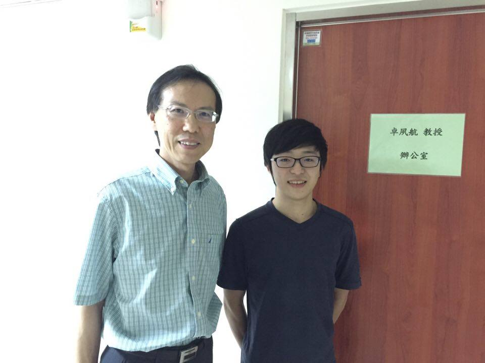
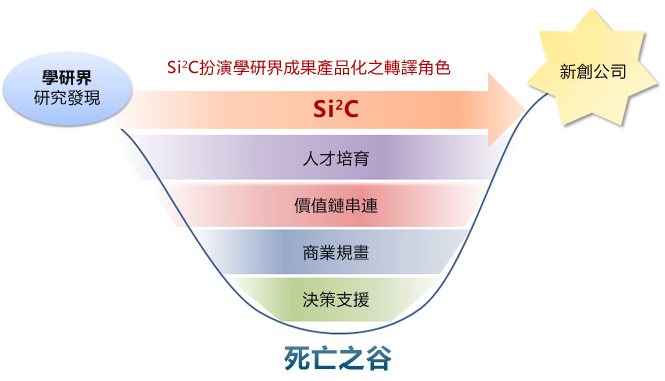
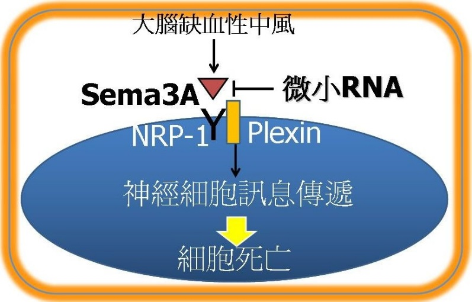

**從小的科學夢**

    卓老師從小就立志成為一位科學家，會選讀醫學系是當初長輩認為當醫生能有較好的出路。不過很慶幸自己的決心感動了家人，有著家人的支持，卓老師才能再醫學系畢業後到國外做研究。在美進修的期間，卓老師從人類基因體計畫做起，對於基因表現如何影響疾病特別感興趣。醫學背景的訓練思維與經驗幫助卓老師在轉譯醫學上的研究能更貼近臨床需求。老師舉例，基亞生技的董事長、大立光的執行長皆是醫學背景，念醫學系不是一定要行醫才是學以致用，「只要有決心解決問題，醫學的訓練很能在其他各行各業發光發熱的。」

**尋找台灣的出路**

    卓老師在美國做研究時，是比爾柯林頓當總統的時期。當時美國的經濟實力強大，國家對於科學研究的補助充足。加上美國的產學交流十分熱絡，業界常常會到學界尋找適合投資的標的，經費充足的情況下研究自然能有更好的產出。

    在台灣做研究就比較需要主動出擊了。就卓老師的觀察，國內情況是，業界比較希望能有快速的結果產出，而創新研究往往需要比較長的路，因此需要學校及政府幫忙。好的學校不但應有理想還要有策略與實質輔導機制。屏科大的食品研究就是一個很好的例子：學校老師可以將研發的產品放到福利社販賣，而福利社就是一個推銷的管道，如果賣得好就有機會被廠商所看見，增加廠商投資意願。如此一來，學校老師有管道可以測試自己的新創點子，也有機會帶來更多資金以投入更多創新的研究。

**跨越學界與業界之間的橋梁**

    想跨越產學的橋樑，最重要就是兩個關鍵：「知識」與「錢」。知識是科學研究的基礎，運用知識來解決臨床上的所面對的問題。當有了成功的研究後，進入臨床就需要金錢的支持。舉新藥研發為例，要從實驗室層級跨到可以大量生產，又或者是毒理測試，動輒上百萬台幣起跳，這可能不是一般實驗室能夠負擔的。而這就是產學中間需要跨越的鴻溝，這段路又可被稱為死亡之谷。卓老師認為，政府若是想要升級產業，提升生技產業的競爭力，填補這個鴻溝就會很有幫助。其中台灣生技整合育成中心 (Si2C) (註一)，以 Branding Taiwan Biotech 為目標，具有流暢的互動機制、建立里程碑式的資金補助，可以協助老師將有潛力的研究商品化。而卓老師團隊的眼藥水(註二) 的研究就是當時被蘇懷仁博士挑選為補助發展的研究之一。該研究目前正準備進入臨床試驗審查 (IND)，朝著新藥開發之路邁進。卓老師說：「創業正是我們下一個里程碑，對於做科學研究的學者來說，創業是我們完全沒有接觸過的。Si2C 專業人員提供創業所需的協助，可以讓做研究的學者有更廣的出路。讓研究不僅僅只是學術，可以有更多發展空間。」

**給想要朝生技領域創業的年輕學者或者是碩博士生一些建議**

    年輕的學者一開始可能會有很多不同方面的壓力。卓老師建議可以先從小型的產學合作案開始累積研究資歷與經費，解決產業中的一些小問題再從問題衍生，慢慢的做大。老師認為最重要的是要主動出擊。一塊肥沃的土壤是需要你自己去探索才知道種不種得出價值高的作物。多參加產學會議認識各方人脈，可以增加自己對市場需求的敏銳度。在從需求出發找到研究方向，成功率會比較高。

**附錄：**

**註一：台灣生技整合育成中心 (Taiwan Supra Integration and Incubation Center, Si2C)**

    成立於 2011 年 11 月，以 Branding Taiwan Biotech為目標，Si2C 結合各領域專家，篩選出具潛力且具新創公司意願之案源，並進行輔導育成，以成立新創公司及商品化，其中亞洲流行病學特色者為優先盤點項目，目前已完成肺癌 (Lung Cancer)、肝癌 (Liver Cancer)、肺結核 (TB) 等項目之盤點。Si2C 藉由經濟部科專計劃以及科技部育苗專案等經費補助成立種子基金，支持前期學術界研發計畫或新創公司與後期的投資接軌，並且建立培育未來具創業精神的跨領域高階人才培訓課程與機制。Si2C網址：http://www.siic.com.tw/

**圖：案源篩選與育成**

**註二：卓老師的研究**

    卓老師由基因的調控與疾病開始他的研究生涯，近 6-7 年轉入了 micro-RNA 的研究。「如果把一個基因比喻作為一個工人，micro-RNA 就是扮演**工頭**的角色，控制一群基因（工人）」。以下是兩個卓老師主要的研究成果。

1. **miR-328的抑制劑來治療近視**

    因此卓老師團隊利用基因多型性找出miR-328對於近視度數的增加有很大的相關性，進而藉 miR-328 的抑制劑來調控與近視相關的基因群而治療近視。目前此研究也準備進入臨床試驗審查 (IND)，希望未來可以透過「miR-328 的抑制劑」解決亞洲國家近視率高的問題，也可以進而預防高度近視引起的白內障、青光眼、黃斑部病變…等併發症。

1. **第十屆國家新創獎 micro-RNA應用於急性缺血性中風之治療**

    在 2010 年，全球急性中風的患者就有 1700 萬人口，其中 75% 為缺血性腦中風，目前唯一獲得美國 FDA 核准治療急性腦中風的藥物是 tPA，然而 tPA 不但須在中風發生 3 小時內施打，還具有引起腦出血的風險，因此使用率約只有 5%。卓老師團隊發現一種具神經保護作用的 **micro-**RNA 藥物，於中風發生 6 小時還可作用，且不會引起腦出血等不良反應。加上此類藥物還有製造簡易的優點。目前已做全球專利佈局，正逐步完成臨床前動物實驗，若能順利開發成功，預計將為中風治療帶來劃時代貢獻，並為國家帶來龐大經濟價值。

**卓夙航教授 Suh-Hang Hank Juo 個人簡歷**

**中國醫藥大學附設醫院醫學研究部**

學歷：

約翰霍普金斯大學基因流行病學博士        1994-1997

哈佛大學流行病學碩士        1993-1994

高雄醫學大學醫學學士        1982-1989

經歷：

高雄醫學大學 醫學系醫學遺傳學科 主任

高雄醫學大學附設中和醫院 醫學研究部 主任

美國哥倫比亞大學 神經內科 兼任副教授

美國哥倫比亞大學, 基因體中心, 基因流病及藥物基因學組 主任

專長︰

1. Gene mapping

2. Genetic epidemiology

3. Statistical Genetics

4. Pharmacogenetics

5. microRNA and functional genomics
