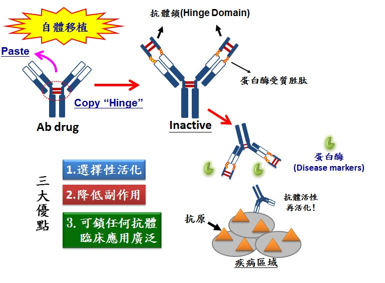
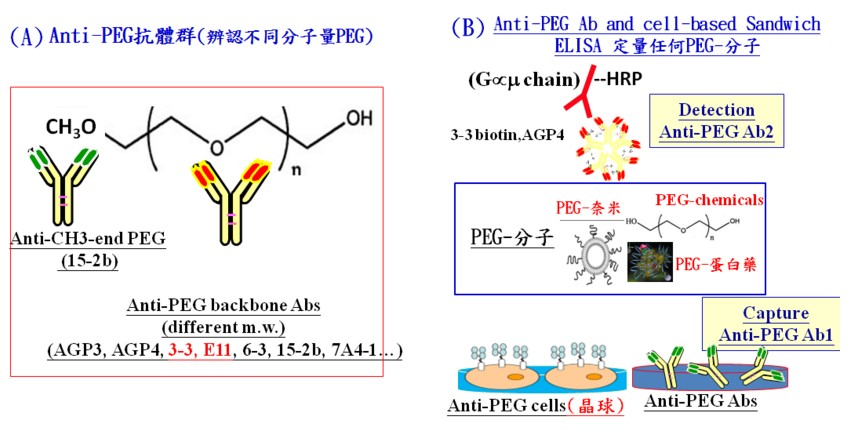
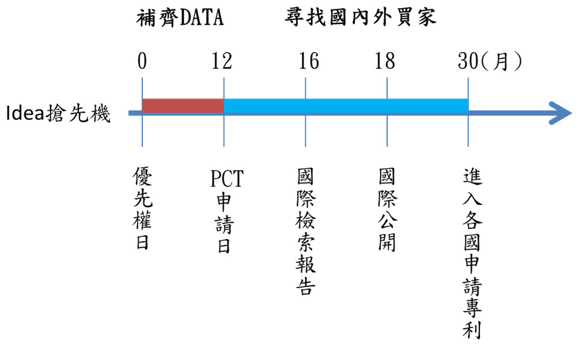
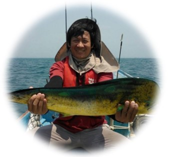
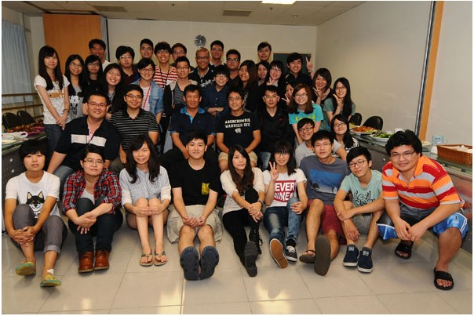

## **研究起源**

醫技背景出身的鄭老師在大學生時期就對轉譯醫學特別有興趣，希望以抗體方式開發檢測試劑。因此研究所的選擇就是抗體研究的頂尖實驗室，到高醫任教後，早期鄭老師是做分子功能性造影的研究，成果都發表在領域中數一數二的期刊，但沒想到在與廠商洽談的過程中反而遇到不少困難。仔細探究原因，鄭老師回想，雖然分子造影探針可以針對特定疾病做有效的標記，但是市場小，比較難找到廠商願意花龐大的金額投資臨床試驗，「如果要將轉譯研究貢獻於全人類，就必須有全球產業應用性的眼光」。

## **歸零再起**

老師在思考過後轉變思維，毅然決然轉而投入具有臨床價值的抗體藥物基因工程。會選擇抗體藥物做研究，因為抗體的應用性廣泛，不論是在學術研究或是臨床治療都十分具有發展的潛力，此外，抗體藥物一年有超過 600 億美金的市場，如此龐大的市場，廠商投資意願相對高，這才易達成轉譯醫學的目標，才能造就大技轉，貢獻全人類。

抗體藥物具有專一性與良好的療效，但是卻有著一個限制，就是長期使用造成的嚴重副作用。因此研發了抗體鎖⁽註⁾，透過抗體鎖來增加對於疾病區域的選擇性，就可以避免抗體藥物對正常組織或免疫系統造成傷害，這個研究是鄭老師團隊技轉最成功的例子，也是目前學術界最大金額的生技藥物技轉。

## **專利的策略與佈局**

這幾年來轉譯醫學一直是熱門的領域，而專利是生技產業的命脈。但是目前台灣學術界以論文發表至上的觀念凌駕於專利佈局之上，因為過去的科學教育比較沒有重視專利的訓練，多數學者也都因升等評鑑制度以期刊論文發表為目標。鄭老師坦言，自己在研究初期的專利佈局能力很差，經由和國外廠商交手吃虧後，才了解專利的重要性。當專利保護不足的情況下就很難以吸引廠商進入燒錢的臨床試驗階段。因此老師將研究習慣改變，當他想到一個新的 idea，不是先上 NCBI PubMed 搜尋，反而是先做全球專利檢索，確認領域第一且沒有人做過相同的研究才投入。鄭老師說，「這個世界上的許多產業需求只需要第一。第一名獨佔市場，第二名之後的市場價值就有很多限制了。」除了做好專利保護，在經費上可以透過申請 NRPB 生技醫藥國家型科技計畫，雖然審查的過程很嚴格，但可以透過國家的經費申請臨時案，並在一年內補齊 data 並申請<strong>世界專利合作條約 (PCT⁽註⁾)</strong>做全球專利佈局，利用 PCT 的時間將 idea 推廣至全球尋找買家。老師還建議需要親自在國內外找尋機會到業界做技術推廣，因為只有自己最了解自己的研究，唯有親自參與才更加了解產業界的需求。

## **如何加值學術研究成果**

老師建議，政府政策多鼓勵學者不僅僅只是為了計劃而只申請台灣或美國專利，若政府、學校能修正升等評鑑制度，將好的 idea 做全球的專利佈局，如此才能讓轉譯醫學研究可以真的走出實驗室發揚光大。另外，在學校方面，應在研究所多增加專利智財的課程與實作工作坊，鄭老師在高醫有多年產學經驗，在擔任產學長的期間積極推動學校開立創新創業、專利分析與實作的課程，希望能透過教育讓學生也具備專利思維，如此不但可以在各實驗室訓練專利種子，也可以協助老師的研究更上一層樓。即使是現在不當產學長，鄭老師仍然要求他的學生都需要做 [TIPA 智慧財產培訓學院認證](http://tipa-certify.com.tw/)、參加專利工作坊學習專利搜尋、專利分析與專利的撰寫。老師認為，藏富於學生是很重要的。當研究生具備這樣的技巧時，就可以更懂得如何保護創新 idea 將研究商品化。

## **有創新專利的研究才有更大機會貢獻全人類**

創新研究與智財專利是可以相輔相成的，好的研究可發表於高品質的期刊，如能加上專利保護，對研究成果的產業化更會是如魚得水，有創新專利的研究才有更大機會貢獻全人類，沒專利的創新研究是較不容易造福人類，為什麼? 因為生醫藥物&醫材的發展到臨床使用，常需經臨床前動物實驗; Phase I, II, III, IV 人體試驗，其花費動輒數十億數百億台幣且成功率不高，如果沒有專利保護，讓廠商有數十年全球獨佔市場，是沒有廠商會願意拿錢出來投資的，難道有廠商願無條件花費數十億數百億完成臨床試驗，讓成果給大家使用嗎?這道理是很容易理解的。近年來學校開設系列智財與創業課程，利用這契機實驗室更積極加值學生跨領域的<strong>智財、創業元素—讓學生更懂得為何要有創新專利的研究才有更大機會貢獻全人類？了解沒專利的創新研究是不容易造福人類的觀念，更要學生充分體會「創業是學術的最佳實踐」</strong>的信念，鼓勵學生參加創業競賽，學習創業實務概念，創業也許是未來一條不錯的選擇之路，教與學相長，藏富於學生，風評自然口耳相傳，這是逐漸建立起堅強硏究團隊的關鍵。近年鄭老師團隊可定量任何 PEG-藥物⁽註⁾ 的 Anti-PEG Abs 抗體材料移轉達 157 件，總金額 NTD 16,644,289 研究成果績效卓著。另外創新抗體鎖 (Hinge) 發明獨步全球，有效改善現今抗體藥物選擇性，為現行抗體藥物的選擇性帶來革命性突破，技轉國外上市大藥廠，金額亦創下台灣生技藥物技轉史上的紀錄 (**成功要件:全球創新研究 + 全球專利佈局 + 國際觀技轉能力，三者缺一不可**)，成功上臨床將帶來百億商機，享受那為所欲為的研究樂趣，完善轉譯研究，貢獻與造福全世界人類。

## 註解

**鄭老師團隊的技轉成果​ - 萬能抗體鎖研究** **(讓抗體藥更具選擇性)**：抗體藥物已為現今臨床主流藥物，但因為所辨認的抗原亦於正常組織表現，造成長期使用易產生副作用。因此，如何再增加抗體作用位子之選擇性有其必要性。鄭老師團隊的研究策略是利用抗體自身之 Hinge domain 結構作為抗體鎖 (閉鎖器)，以蛋白酶受質胜肽連結抗體和此閉鎖器，形成具屏蔽抗體結合能力之閉鎖器-抗體，唯有在蛋白酶過度表現的疾病區，閉鎖器才能被移除，回復抗體功能，增加抗體對疾病區域之選擇性，並降低全身性副作用，提供病人更好的生活品質。未來抗體鎖每鎖1抗體藥就可產生1技轉，預計其專利具有百億美元以上的商機。

**鄭老師團隊的技轉成果​ - Anti-PEG antibody 開發**：Polyethylene glycol (PEG) 是一種美國 FDA 許可使用於人體的高分子聚合物，在臨床上已越來越廣泛使用許多藥物都混合 PEG 來提高藥物在體內的半衰期，5 年內預估其潛在產值將達到 100 億美元以上，因此定性與定量 PEG 修飾分子在活體內外的藥物動力學，對藥物的臨床應用發展很重要，商機無限。因此實驗室開發了創新的 PEG 的抗體，目前每月來自各世界大藥廠的技轉數仍持續增加中，因此 Anti-PEG Abs 促進產業發展之具體成就顯著。

<strong>WIPO 世界智慧財產權組織主導而生的專利合作條約（PATENT COOPERATION TREATY，簡稱 PCT）：</strong>在 PCT 制度建立後，申請人可以單一的貨幣、格式、語言向受理局提出申請，除了程序簡便，可盡早確立優先權日，而申請人也可依據國際檢索報告，評估是否進入該國市場，延遲了各國的專利申請費、翻譯費、審查費，並讓申請人的資金靈活運用，透過這種合作方式，單一國家專利審查的資源消耗也可大幅降低。但對於無法同時佈局多國專利的申請者，PCT 不啻為先占有專利權的好方法。**台灣雖非 PCT 會員國，但可透過中國專利局提出 PCT 申請。** (資料來源：[新竹科學工業園區網頁](http://www.hbmsp.sipa.gov.tw/itri/tw/images/NewsList1010806_05.htm))

**鄭添祿教授**

國防醫學院&中央研究院生命科學所博士 (1995–1999)、國防醫學院微免所 碩士 (1991–1993)、高雄醫學院醫學技術學系 學士 (1987–1991)。現任高雄醫學大學醫學院醫學研究所  所長 (2014/09–)、高雄醫學大學生物標記暨生技藥物研發中心  中心主任 (2014/09–)、高雄醫學大學生物醫學暨環境生物學系  教授 (2008/08–)。曾任：高雄醫學大學產學營運處  產學長 (2013/3–2014/07)、高雄醫學大學產學推動中心  主任 (2011/8–2013/2)。鄭添祿老師實驗室[網頁](http://lulab.kmu.edu.tw/index.php/profile-tw)。電話: 07-3121101#2697、E-mail:  [TLcheng@kmu.edu.tw](https://web.archive.org/web/20211202194714/mailto:TLcheng@kmu.edu.tw) / [tlcheng5024@gmail.com](https://web.archive.org/web/20211202194714/mailto:tlcheng5024@gmail.com)

鄭老師實驗室團隊

