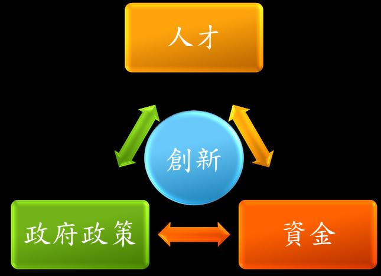

## **何為醫療器材？**

依行政院衛生署訂定醫療器材管理辦法，醫療器材按照其風險性分三級，第1級為低風險性器材如體溫計、紗布等非侵入性器材，第2級則是中風險性、半侵入性如骨釘、骨板、血管夾等器材，第3級則為高風險性、置入體內後經長時間才取出或不取出之器材，如骨填充物、心臟支架、心律調節器等。其中第3級醫療器材因其風險高、技術門檻高及所需投資期長，只有少數公司願意進行研究、開發。

## **以追尋 VCF 的 Total Solution 為例** 

以學長服務的中央醫材來說，2004年開始積極投入開發椎體成型術之醫療器材，椎體成型術屬於一種不同於傳統手術，只需要局部麻醉、手術時間短、幾乎不會失血，大幅降低麻醉及手術的風險之微創手術，此微創手術的新技術近年來被廣泛使用並擁有巨大的市場潛力。 對於脊椎體壓縮性骨折 (Vertebral compression fracture, VCF) 或者骨質疏鬆症 (Osteoporosis) 傷/患者，10年前的醫療方法多採取進行開放性手術，醫師經目視受傷脊椎體再用骨釘、骨板支撐固定後縫合，手術十分耗時且需長時間休養，並極有可能有傷口感染疑慮。隨科技進步，Vertebroplasty 微創技術發展出來，藉由影像導引，在患處上方皮膚打開一小切口並用導管引灌骨水泥 (Bone cement) 混合物至裂損區域，而產生填充固定效果，此法大大減少手術時間及回復期。第二代Kyphoplasty技術 (KYPHON公司推出) 是進一步改進之方法，先置入氣球 (Balloon) 至塌陷處，在椎體內撐起一個空間後取出氣球再灌入骨水泥，但仍有滲漏的風險存在。在此情況下，冠亞集團旗下 A Spine Holding (ASH) 公司開發出第三代Vessel-X 骨填充囊袋技術 (又稱 Vesselplasty)，將原本前方氣球取代為一具有微小孔徑之植入性 PET 生物相容材質之球囊，在打入骨水泥固定後不取出，此法可使椎體高度恢復率高達98%且無滲漏問題。而中央醫材更進一步取得 ASH 公司之 Vessel-X 骨填充囊袋獨家授權生產，搭配自行研發、容易控制、可被人體部分自行吸收之 Osteo-G 骨骼填充物，及骨填充物智慧型導入系統，推出同時減輕手術時間、病人疼痛及減低併發症之整合性產品 VCF-X Bone Filler Delivery System ，得以投入醫材市場。

### 20121110沙龍2-2

## **全球醫療器材市場佈局分析**

依據金屬工業研究發展中心報告，2006年醫材市場規模約為1,832億美元，而在2011年進一步達到2,475億美元，呈穩定成長的趨勢，其中以美洲地區佔一半以上市場大宗，西歐及亞太地區次之。台灣佔全球醫材市場的0.4-0.5%，世界排名二十名，醫材出口以第一、二類之消費型醫療器材為主 (代步車、隱形眼鏡、血糖儀、耳溫槍等) ，等比例換算之下約可有300多億新台幣市場價格。但在美、日、德、法、英、中、義等列強環伺之下，尤其是日本及中國的夾擊下台灣有何機會呢 (參閱[當邊界被跨](/posts/asiabiotech-challenge/ "當邊界被跨越 – 亞洲生技業面臨的挑戰與問題")[越](/posts/asiabiotech-challenge/ "當邊界被跨越 – 亞洲生技業面臨的挑戰與問題") **[–](/posts/asiabiotech-challenge/ "當邊界被跨越 – 亞洲生技業面臨的挑戰與問題")**[亞洲生技業面臨的挑戰與問題](/posts/asiabiotech-challenge/ "當邊界被跨越 – 亞洲生技業面臨的挑戰與問題")以及[該如何因應](/posts/asiabiotech-response/ "“當邊界被跨越 – 亞洲生技業該如何因應”"))？

## **Big issue-台灣生技產業現況與挑戰**

(筆者：不僅是醫材領域，其他生技類領域也是有如此現象)生技產業如右圖所示概分為二，其中上游指研究單位：各大專院校的焦點主要放在基礎研究，但實質上跟產業間之間幾乎沒有實質上的互動與長期的合作計劃。而下游則是產業界：具有市場敏感度，但是缺乏新穎的產品以及更安全、更有效率的解決方法之技術，導致沒有新的產品可以滿足市場端消費者（醫師與病患）的需求，只能自行研發或是向國外代理新的產品。但是研發動能不足，使得上下游中間存在一個鴻溝！ 上下游一直無法密切配合的原因在於缺乏相關生醫背景的[專業經理人](/posts/biotech-project-manager-yenlun-huang/ "勇敢的逐夢人 – 從生科人到藥廠專案經理 – 黃嬿倫")以及[人才](/posts/biojob-informations-taiwain/ "台灣生技領域人才就業問題")，這些人才必須具有智財、財務管理、併購、技轉以及創投的概念與專業知識。在台灣的生技產業，這些領域的人才真的是少之又少！造成上下游各做各的，無法作一條龍的連貫 (垂直整合) 以及挹注資金來幫助有潛力的公司成長。其實，生技產業要能夠長遠的走下去，是需要有個理想的良性循環的—上游的研發經費可由下游來支持，以下游市場需要的產品為導向，促使上游研發單位能更精確地研發出可以嘉惠病人的新技術以及新醫療器材，而研發後的成果可以共享，而後技轉給下游廠商，進行研發的同時亦須兼顧將來的應用性，而要知道如何有應用性則仰賴雙方的密切溝通合作。

## **讓我們看看美國**

美國白宮日前發布2012國家生物經濟藍圖 (註1)，內容直指生物經濟的五大趨勢為：健康、能源、農業、環境及知識技術的分享。除了強化生物技術的各類研究發展外，還要促進生物技術發明的市場應用與商業化，並發展、改革相關規範以減少法規障礙並增加程序的效率與可預測性，以及調整人才培訓機制以符合國家、產業發展的勞動需求。另外還有一項支持公私夥伴及競爭前合作 (Precompetitive Collaborations) 關係的發展：主管機關鼓勵、支持公私或私人部門間形成夥伴關係，共同針對生物醫藥及食品安全進行創新研究發展。 針對公私部門間如何形成夥伴關係，其實國內頗多學校已經設有育成中心負責擔任產學合作的[平台](/posts/collaboration-between-industry-and-school/ "以社群網絡點燃產學合作的新火花")，目前正逐漸成形中，而我們還可參考香港大學(**註2**)的形式：香港大學除校內成立技術轉移處負責管理港大的知識產權資產的使用外，另還全資成立一商業單位 (港大科橋有限公司) 負責一切技術轉移有關的商業安排，如此一來研究單位轉移後的技術不必擔心沒有適合的商業推廣而無法實際達成應用，也不必花費心力找尋或培養擁有商業眼光的研究人員。

## **身為未來新鮮人或投入產業的社會人，What’s our next step？**

學長下圖做總結，提醒我們：產業發展要保持以創新為中心的宗旨，也需要有能融合斷層 (fuse gap) 人才，而投資者必須能夠了解生技產業的特性後順勢挹注資金，並驅使政府推動政策改變，才會有機會更進一步。由此可知，人才、資金、政策為三個主要的影響點，我們是否應期許自己朝滿足這三點中的某些需求或進一步推動改革的目標來邁進呢？也因此育頡學長了解自己尚缺乏”專業經理人才”的能力，毅然決定回頭攻讀政治大學 MBA 學位，充實自己以符合產業界的需求。

.

**註1 - 2012 美國國家生物經濟藍圖**：http://www.whitehouse.gov/sites/default/files/microsites/ostp/national_bioeconomy_blueprint_april_2012.pdf

**註2- 港大技術轉移介紹**：http://www.ke.hku.hk/cht/solutions/technology-transfer

- 本篇為林育頡學長在 Connectome 11月10日「生技人，醫材知多少」職涯沙龍的分享整理 -

分享者：林育頡，北醫保健營養學系、陽明/政大生物科技管理學程結業，曾任冠亞控股集團及中央醫材高階醫材研發工程師及產品經理，具有產品開發、專利撰寫、臨床試驗規劃、產品上市等經驗，目前為全職政大AMBA碩士生 
