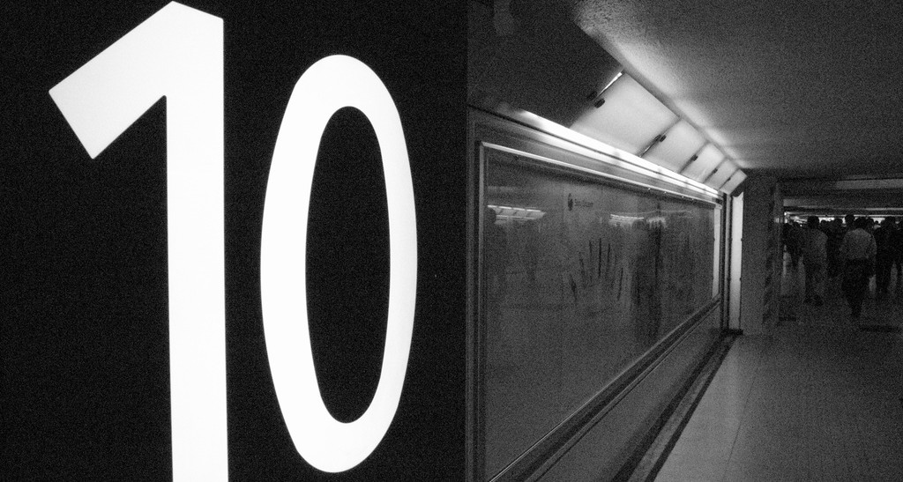
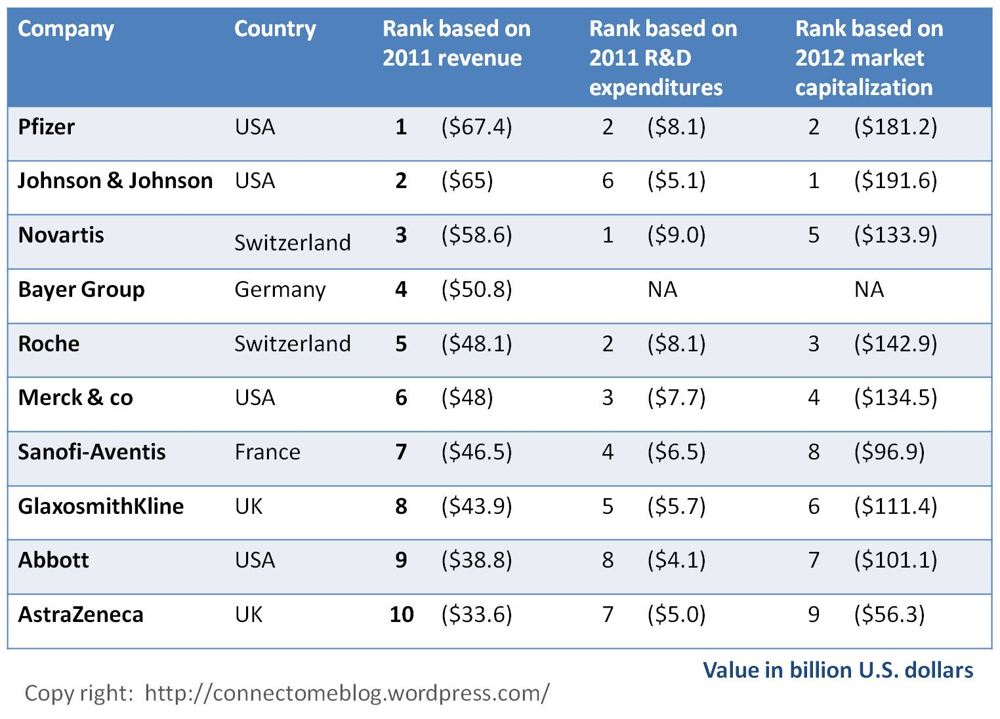
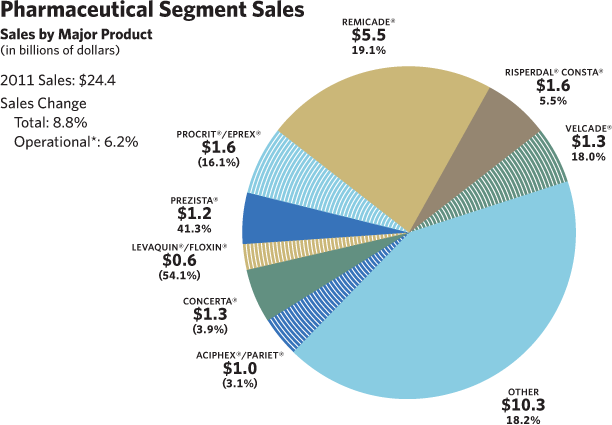
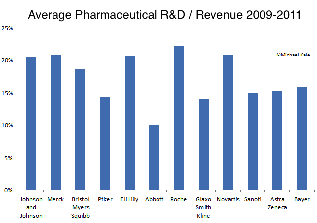
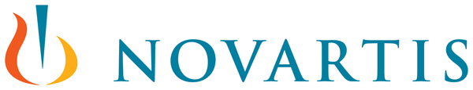
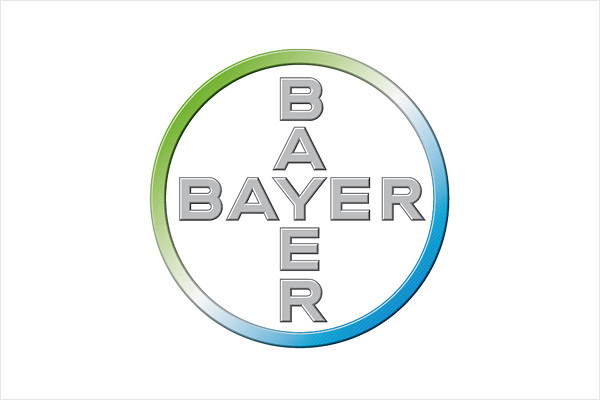
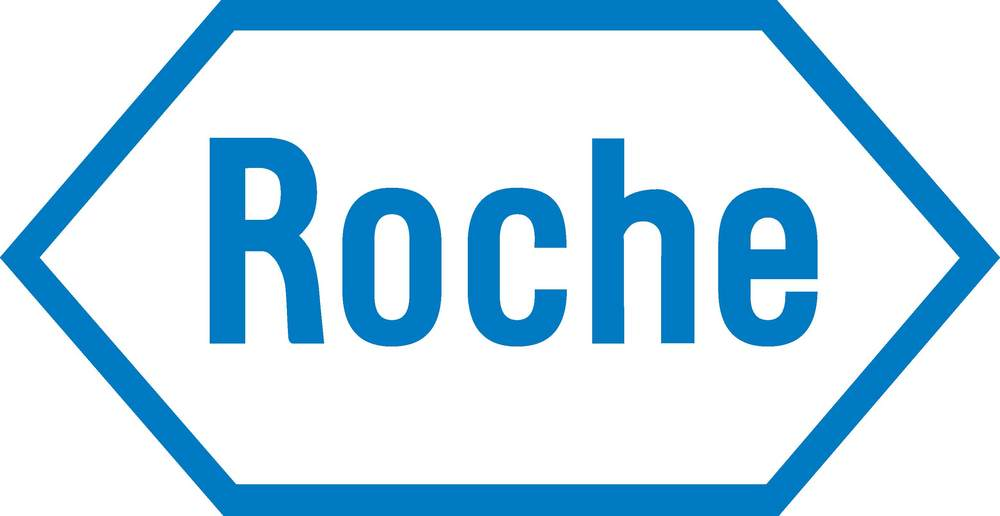
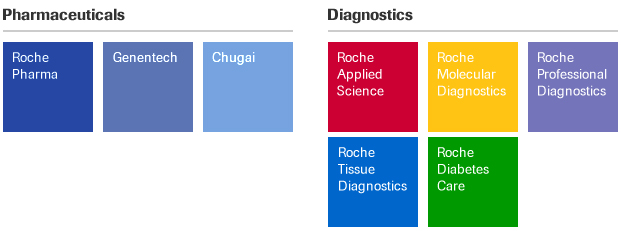
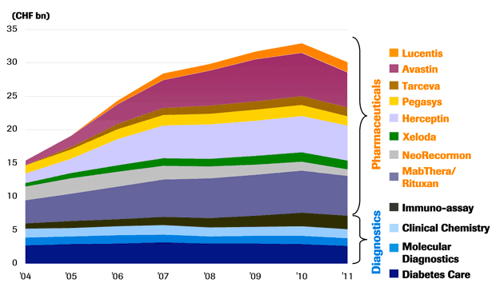
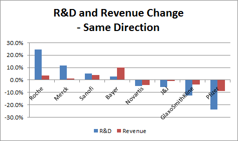

**資料來源 ** Rank based on 2011 Revenue: http://tinyurl.com/8zej4fn Rank based on 2011 R & D expenditures: http://tinyurl.com/8lgjofu Rank based on 2012 market capitalization: http://tinyurl.com/9exfhnr

**本文僅做為產業介紹與活動推廣之用，文中所列舉公司皆參考自以上資料來源，Connectome 與各廠商並無任何直接或間接之合作關係，亦無推廣所述及藥物之意圖與事實。**

# 

# %%COLORCLOSE%%

Pfizer international website: <http://www.pfizer.com/home/>輝瑞臺灣網站: <http://www.pfizer.com.tw/index.asp>

## **%%COLOROPEN:#333399%%輝瑞**

成立於 1849 年的 Pfizer 是製藥業的知名大廠，1944 年利用特殊的發酵技術大量生產盤尼西林 (Penicillin)，為世上第一個商業化生產的抗生素，也被認為是 20 世紀最重大的發明。1950 年代後輝瑞日漸堅強的行銷能力已不容忽視，使得輝瑞甚至開始以支付授權金的方式替其他公司販售產品，進而增長營收，然而這樣的模式雖然帶來營收的成長，但此時競爭對手默克與禮來等已大舉提高研發支出，使得輝瑞的研發實力一度落後其他藥廠。因應全球藥廠競逐於新藥研發領域，輝瑞於 1971 年設立 Central Research 部門整合各地研發工作，而輝瑞研發支出占銷售而比重也一路上升，1994 年時該公司年銷售額為 74 億美元，在全美製藥業中排名第六 (參考[資料](http://www.americatimes.net/detailed.asp?id=1330))。

## **研發成果與現況**

輝瑞所研發的 Lipitor (立普妥) 無疑是製藥業暢銷藥物 (Blockbuster)的代表，從 1997 年上市至今，Lipitor 的總銷售額已突破 **1250 億美元**， 2006 年的銷售紀錄 129 億美元更占輝瑞營收的 27%。然而這樣的輝煌紀錄在 2011 年 Lipitor 專利到期後便使輝瑞陷入專利懸崖 ([Patent cliff](http://www.hbmsp.sipa.gov.tw:9090/itri/tw/images/NewsList1010905_06.htm "輝瑞藥廠面臨專利懸崖—暢銷藥立普妥(Lipitor)專利到期")) 的處境，使輝瑞必須以刪減支出、併購等方法維持財務的健全。

## 

## 

雖然這幾年輝瑞刪減研究經費與人力，然輝瑞 2011 年的研發支出仍高達 81 億美元，而目前 pipeline 中臨床三期與 filing 的藥物便多達 30 種。

## **重點動態**

**併購惠氏大藥廠** 2009 輝瑞以 680 億美元併購惠氏大 藥廠 (Wyeth)，可說是製藥業併購案史上的最大交易，而這起併購案除了使輝瑞的產品涵蓋治療範圍更廣，同時也降低了雙方的日益攀升的成本比重。更重要的是，併購惠氏也將能彌補暢銷藥物立普妥因專利到期 (2011) 而造成的營收損失，幫助其營收成長，使其總營收突破七百億美元! (參考[資料](http://www.coolloud.org.tw/node/34529 "輝瑞2.29兆併購惠氏 看中抗憂鬱製藥專利 "))。 **減少研發支出，裁減人力，關閉工廠** 由於製藥業普遍出現藥物研發的瓶頸，導致投入的研發資金所得的報酬率降低 (下降 3.4% 成為 8.4%，參考[資料](http://www.he-cn.com/article.asp?id=38972 "全球五大關鍵詞")) ，在許多藥廠致力於減少成本支出的情況下，占最大比重的研發支出便有減少的趨勢，而輝瑞亦是。以往藥廠的研發支出占營收的比重平均介於15% 至 20%，但輝瑞卻是低於15% (參考[資料](http://bioforth.blogspot.tw/2012/05/blog-post_11.html "製藥產業數據分析: 全球前十大藥廠研發支出變化"))。 繼 2008 年裁員一萬人後 (占員工數 10%)，近幾年輝瑞仍然持續裁撤人力 ，而隨著惠氏的併購案所帶來的人事精簡更大砍了一萬三千多人 (參考[資料](http://nanobio.pixnet.net/blog/post/25005278-%E4%B8%96%E7%95%8C%E5%A4%A7%E8%97%A5%E5%BB%A0%E7%9A%84%E8%A3%81%E5%93%A1%E6%BD%AE "世界大藥廠的裁員潮"))。2010 年五月，輝瑞更進一步宣布將在五年內裁員 6000 人，並關閉八座工廠，期待能減少更多的成本支出 (參考資料 [1](http://cn.ibtimes.com/trad/artnews/277/20100518/pfizer-to-axe-6000-workers-shut-down-8-plants.htm "輝瑞五年內將裁員6000人 關閉8家分廠") 、 [2](http://www.360doc.com/content/11/0215/16/2566540_93264523.shtml "国际大型制药公司削减经费外包研究"))。

# 

.

## 

Johnson & Johnson international website: [http://www.jnj.com/connect/](http://www.jnj.com/connect/) 嬌生臺灣網站: [http://www.jjmt.com.tw/index.php](http://www.jjmt.com.tw/index.php)

## **嬌生**

成立於 1886 年的嬌生集團是世界知名的消費保健公司，目前在全球有 250 間分公司與子公司，跨足 57 個國家，集團的事業體分為三個部門，即 Consumer Health Care，Medical Devices & Diagnostics，Pharmaceuticals，分別占該集團營收的 23%、40% 與 37% (2011 年[資料](http://www.worldpharmaceuticals.net/editorials/21/Top%20ten%20global%20pharma.pdf "Top10 Global pharma")) **Consumer Health Care** 該事業體部門產品包含嬰幼兒用品、皮膚與口腔用品等日用消費品，產品涵蓋範圍廣泛，且許多產品都有很高的市占率。 **Medical Devices & Diagnostics** 嬌生為全球最大的醫療器材製造商 [其他知名醫療器材商: 包括奇異 (General Electric)、美敦力 (Medtronic)、西門子 (Siemens)、費森尤斯 (Fresenius)]，尤其在心血管醫療器材領域，嬌生可說是市場的領導廠商，其他產品還包括[體外診斷試劑](/posts/taiwan-diagnostic-device/)、人工關節、血糖機等等。值得一提的是，嬌生以無菌外科手術敷料開啟其在醫療器材領域的發展，至今通路已相當完備又堅強，致使其他新創公司要與之抗衡需要更大的成本與努力。 **Pharmaceuticals** Pharmaceutical 事業體占集團營收的 37%，其中占營收比重最大的關節炎用藥 Remicade 更是 2010 年最暢銷的生技藥品，然 Remicade 的歐洲專利在將在 2014 年到期 (美國則是 2018)，已有廠商磨拳擦掌的要搶攻該藥的學名藥市場 (參考[資料](http://magazine.n.yam.com/view/mkmnews.php/735910 "生技大老蘇懷仁：台灣搞生技，還不是個「咖」"))。

## **研發成果與現況**

2011 年嬌生 Pharmaceutical 共投入了 51 億美金的研發經費，而在 2011 年嬌生便有至少五個藥品獲得上市許可 (參考[資料](http://files.shareholder.com/downloads/JNJ/2085510063x0x583144/dfe23d05-ecb2-42e4-9be8-1392473f5481/Q22012pipeline.pdf "Pharmaceutical/Medical Devices and Diagnostics Pipeline"))，而嬌生近三年研發支出占營收的比重一直在 20% 左右。然而就在今年八月，嬌生宣布與輝瑞共同合作的阿茲海默症疫苗 bapineuzumab 臨床試驗第三期失敗，並且以中止該試驗 (參考[資料](http://news.cnyes.com/content/20120724/KFLLH3PQTPK7Y.shtml "輝瑞宣佈新藥在北美的試驗結果不如期待"))，使嬌生在阿茲海默治療領域的研究受挫。

## **重點動態**

**併購 Synthes ** 2011 年 4 月嬌生宣布將收購瑞士醫療設備生產商 Synthes，該交易於今年六月完成，交易金額為 197 億美元。Synthes 主要生產骨科相關的醫療器材，而此項併購案是嬌生史上最大的交易，這項併購預計可提高嬌生在全球醫療器械市場的優勢 (參考[資料](http://blog.sina.com.tw/lifung/article.php?pbgid=24968&entryid=602180 "嬌生 Johnson & Johnson 216億美元收購信迪思 Synthes 成為骨科設備大廠"))。

# .

# 

Novartis international website: [http://www.novartis.com/index.shtml](http://www.novartis.com/index.shtml) 諾華臺灣網站: [http://www.novartis.com.tw/](http://www.novartis.com.tw/)

## **諾華**

諾華成立於1996年，由汽巴嘉基 (Ciba-Geigy) 和山德士 (Sandoz) 兩家公司合併而成，在心血管、腫瘤、免疫等領域具有很強的研發實力，而諾華在疫苗研究領域更具有長久的發展歷史。目前諾華全球的員工數約為十萬人，其中有約四千人的研究人員，而在臺灣的員工數則有約七百人。

## **研發成果與現況**

長久以來，諾華皆獲得不少獎項與聲譽，其中也包括最具有創新能力的公司。諾華的研發支出近三年皆超過 20%，且是少數具有成長的趨勢的大型製藥公司 (參考[資料](http://mkale.com/pharma/2012/04/rd-spending-by-large-pharmaceutical-companies.html "R&D Spending by Large Pharmaceutical Companies"))。2011 年諾華在藥品研發的支出達 68.6 億。 諾華最暢銷的藥品心血管用藥 Diovan 在 2011 年為諾華帶來 57 億美元的營收，然其專利已在今年九月到期，而其第二暢銷的癌症用藥 Glivec/Gleevec 也將在 2015 年專利到期 (Diovan 與 Glivec/Gleevec 分別是台灣 2011 年最暢銷藥物第九、第六名，參考[資料](http://www.shou-chan.com/NEWS/20120627-01.htm "2011年明星用藥排行"))。

## **重點動態**

**Sandoz - 世界第二大學名藥廠** 2003 年開始，諾華總部決定將 Sandoz 定位在學名藥的生產與開發，至今 Sandoz 是全球第二大的學名藥藥廠 (僅次於以色列 Teva)。Sandoz 的產品除了學名藥以外，還包括原料以及化學合成藥品等。 由於接下來幾年許多市面上的暢銷藥物將會陸續失去專利保護，而學名藥的市場預估會高達 64 億元美金，且將具有很高的成長動能，因此 Sandoz 可說是在學名藥的市場提早布局，尤其因國內健保給付額的關係，Sandoz 在 2007 登陸台灣，以價格低但高品質的藥品切入市場 (目前產品已多達八百多種)。 綜觀學名藥發展的契機包括：專利藥品到期、藥費給付制度、醫療保險致力於將低醫療成本、新藥開發成本不斷攀升、仍具有一定利潤空間等。 **併購 Alcon** 2010 年諾華以總計 516 億美元的金額完成對愛爾康 (Alcon) 的收購，由於愛爾康是全球最大的眼睛保健產品業者，故此併購案將使諾華以高達 70% 的市占率成為全球眼睛保健市場的龍頭。由於眼睛保健市場的成長強勁，再加上人口老化所帶動的產品需求，眼科保健產品未來將可為諾華帶來可觀的營收 (參考資料[1](http://www.worldjournal.com/view/aFinancenews/10685822/article-%E8%AB%BE%E8%8F%AF-%E5%AE%8C%E6%88%90100-%E4%BD%B5%E8%B3%BC%E6%84%9B%E7%88%BE%E5%BA%B7 "諾華 完成100%併購愛爾康")、[2](http://belongnews.pixnet.net/blog/post/29954645-%E2%98%85%E7%91%9E%E5%A3%AB%E8%AB%BE%E8%8F%AF%E8%97%A5%E5%BB%A0%EF%BC%88novartis%EF%BC%89%E4%BD%B5%E8%B3%BC%E9%9B%80%E5%B7%A2%EF%BC%88nestle%EF%BC%89))。　 **Novartis Biocamp - 諾華生技經營培訓營** 2004 年台灣諾華為了培養生技產業的人才，讓生技領域的學生能夠對實際產業有更深的了解，並且開啟不同領域學生之間的交流，因此創辦了諾華生技菁英培訓營，在營隊中團員必須跟不同背景的其他學生一起互相合作與競爭、模擬商業企劃、培養領袖氣息等軟實力，進而啟發學生對於產業的認知以及思考自己的定位，參加者往往收穫頗豐。而這樣的活動更得到諾華總部的認同與重視於是演變成全球性的活動 (參考[資料](http://alveice.blogspot.tw/2011/04/blog-post_5672.html "台灣諾華蘊育全球生技菁英 創建人才的培育策略"))。 Connectome 團隊許多成員也都參加過 Biocamp，因為收穫良多所以推薦讀者參與該活動。

# .

# 

Bayer group international website: [http://www.bayer.com/](http://www.bayer.com/) 拜耳臺灣網頁: [http://www.bayer.com.tw/tc/homepage.asp](http://www.bayer.com.tw/tc/homepage.asp)

## **拜耳**　

拜耳創立於 1863 年，公司最初以生產化工產品為主，歷經發展與變革後，1979 年於康乃狄克州成立製藥研究中心，初期作品包括心血管疾病用藥 Adalat OROS、抗生素 Ciprobay/Cipro。2003 年後拜耳集團重陸續重組成為 HealthCare、CropScience、MaterialScience 三個主要事業體。2005 年拜耳收購了 Roche 的保健消費品部門，成為世界前三大非處方藥品供應商。

## 

## **研發成果與現況**

事實上拜耳集團的營收中，HealthCare 約占 47% (2011年)，因此單就製藥領域的營收與表現的話，部分藥廠的營收可能較 Bayer HealthCare 為高 (如 Eli Lilly、Bristol-Myers Squibb)，但拜耳致力於拓展其醫藥事業的決心可從其研發支出看出端倪，2011 年 Bayer HealthCare 的研發支出占集團的 67.7% 。 2011 年 Bayer HealthCare 的營收為 172 億歐元 (在臺灣則約 33 億新台幣)，然而在在今年初，拜耳便宣布短期內將推出四個暢銷藥物，並預測推升營收在 2014 年時達到兩百億歐元 (參考[資料](http://tinyurl.com/8tdubse "Bayer Lists Potential Blockbuster Drugs, Eyes Emerging Markets"))。

## **重點動態**

**併購先靈藥廠 (Schering AG) **2007 年拜耳以高過競爭對手默克的出價 (170 億歐元)，完成對德國柏林先靈藥廠的收購，並將先靈公司更名為拜耳先靈西藥部，這起併購案乃是拜耳集團史上最大的交易，該併購將增添拜耳在生技領域的實力，並拓展其產品涵蓋領域。

# 

# .

Roche international website: [http://www.roche.com/index.htm ](http://www.roche.com/index.htm)羅氏大藥廠臺灣網站: [http://www.roche.com.tw/](http://www.roche.com.tw/)

## **羅氏**

創立於1896年，總部位於瑞士巴塞爾，早期以維生素及鎮定劑等藥物文明。21 世紀後羅氏以 Herceptin、MabThera、Avastin 標誌了其在單株抗體以及腫瘤用藥領域的重要角色。目前羅氏的核心業務分成西藥部門 (Pharmaceuticals) 以及診斷事業部門 (Diagnostics)，而羅氏更是世界體外診斷領域的領導者。

## **研發成果與現況**

目前羅氏最暢銷的藥品為Avastin、Herceptin、MabThera，身為全球最大的抗癌藥廠，羅氏在今年六月宣布將關閉位於紐澤西的研究中心並裁減一千個職位，將研發重點集中於病毒、新陳代謝、腫瘤及神經科學藥物。 

羅氏近三年的平均研發支出高於其他製藥公司，然這樣的研發支出目前尚未帶來顯著的營收增長，考量藥物開發的過程與性質，目前的研發支出是否能在未來產生相應的利益，已經是許多藥廠開始思考的重大議題。

## 

## **重點動態**

**併購 Genentech** 成立於1976 年的 Genentech 是美國歷史最悠久的生物技術公司，由於看好生技製藥的前景，1990 年羅氏便以 20 多億美元購買 Genentech 60% 的股份， 2009 年羅氏更以 468 億美元併購了 Genentech，使羅氏從化學藥品跨足到生技製藥 (蛋白質藥品)，由於生技製藥的銷售業績成長幅度較化學藥品為高 (參考[資料](http://blog.udn.com/hsieh1698/6532369 "羅氏藥廠楊育民：台灣生技應集中發展化學新藥"))，此項併購預計將可提升羅氏的營收，尤其是 Genentech 的癌症用藥 Avastin 與 Rituxan，每年皆為羅氏帶來可觀的營收。
