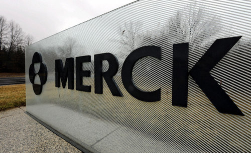
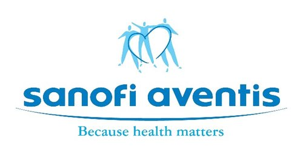
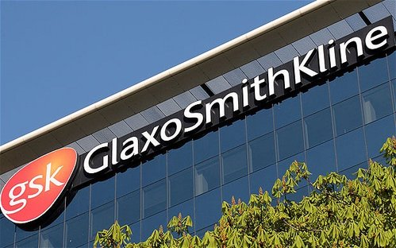
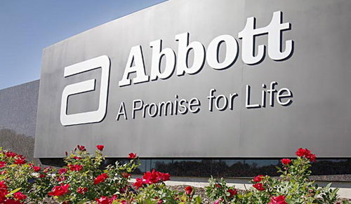
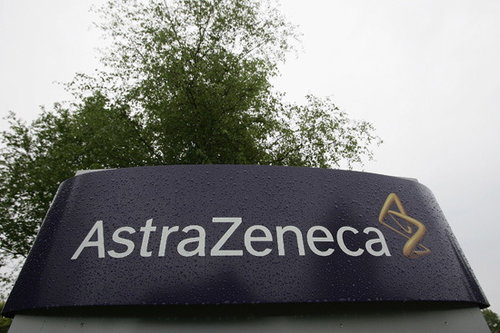

**資料來源** Rank based on 2011 Revenue: http://tinyurl.com/8zej4fn Rank 

based on 2011 R & D expenditures: http://tinyurl.com/8lgjofu

Rank based on 2012 market capitalization: http://tinyurl.com/9exfhnr

**本文僅做為產業介紹與活動推廣之用，文中所列舉公司皆參考自以上資料來源，Connectome 與各廠商並無任何直接或間接之合作關係，亦無推廣所述及藥物之意圖與事實。**

.  . . . . . .

Merck international website: <http://www.merck.com/index.html>

默克台灣網站: <www.msd.com.tw>

## **默克**

**創立於 1668 年，是世界上歷史最悠久的製藥與化學公司。**當年第一位默克在德國頂下一間店面開始經營藥局生意。1891 年，默克的子孫在紐約成立分公司，使默克藥廠從此在美國生根。美國分公司初期的業務主要是自德國母公司進口化學藥品，隨著業務日益成長，1902 年時於紐澤西州正式成立 Merck & Co.，開始以製造逐漸取代原本的純進口業務。默克是目前市值 (2012市值: $134.53 billion ) 和收入最大的公司之一，公司在2011年的收入為十億美元，營業額為七百三十億美金，擁有員工八萬六千人。

### **研發成果與現況**

歷史悠久的默克藥廠產品眾多，除了涵蓋心血管、抗感染、骨科、疼痛、皮膚、呼吸、糖尿病、專科藥品、輔助生殖等領域的 42 種人用藥品和疫苗之外，還有提供 46 種動物保健產品，用以預防和治療家禽家畜以及寵物的疾病。除了線上的藥品之外，默克目前也有 20 種以上的藥品在臨床試驗第三期，七種正準備上市。雖然產品多樣，但普遍預估其未來四年的業績年成長率將低於 1％。默克要在四年內擴張市場版圖將很困難，反而會讓成長快速的葛蘭素史克藥廠 (GlaxoSmithKline, 簡稱GSK) 和羅氏 (Roche) 迎頭趕上，甚至超前。

### **重點動態**

* 1993，收購了 Medco 公司，進入醫療保健領域。
* 1998-2000 年，默克公司收購一系列創新生物技術公司，如 Biogen、Synaptic、Vical 和Sibia Neurosciences，進一步加強其科技研發實力。
* 2009 年以 411億美金買入先靈葆雅 (Schering-Plough)，進一步擴張藥物版圖。

. .  . . . . .

Sanofi international website: <http://en.sanofi.com/>

賽諾非台灣網站: <http://www.sanofi.com.tw/l/tw/zh/index.jsp>

## **賽諾菲**

賽諾菲－安萬特，由賽諾菲－聖德拉堡和安萬特兩家公司在 2004 年合併成立。是在全球具有領導地位的製藥公司之一，分佈在全球 100 多個國家，員工達 10 萬名，其總部在法國巴黎。賽諾菲在台灣排名前 5 大製藥公司，總部設在台北。去年 (2012) 市值為$96.99 billion。

## **研發成果與現況**

賽諾菲上市的產品中，在各自的治療範圍中都屬於世界領先的藥物，如在血栓、心血管疾病、睡眠障礙、癲癇、新陳代謝疾病和癌症等領域。並跨足醫學美容及消費保健系列 (CHC)，將微整型產品3D 聚左旋乳酸 (PLLA) 舒顏萃 Sculptra®、玻尿酸保濕精華素 (Hyaluronic acid) 維詩朵 Viscontour® Serum，以及女性私密清潔品牌 - 立朵舒及法國第一口服美容保養品牌歐諾比。雖然明年保栓通 (Plavix) 和兩款學名藥 Lovenox，Taxotere 的美國專利將會到期，將但透過併購獲得美國生技製藥的酵素替代療法，再加上罕見疾病用藥葡萄糖腦甘脂脢 (Cerezyme) 及龐貝氏症解藥 Myozyme 這兩隻金雞母，能讓賽諾菲一路領先到 2016年。

## **重點動態**

來自法國巴黎的賽諾菲，過去十年，透過併購讓公司排名一路往前衝，成為 2012 年製藥業的領頭羊。專家預測賽諾菲在未來四年內，年成長率將達到4%，穩佔鰲頭。就算其他藥廠循相同模式，大舉收購，也無力撼動賽諾菲的地位。據倫敦調查機構 (EvaluatePharma) 估計，賽諾菲將一路領先至 2016。

* 1999年 賽諾菲灑下 300 億美元，併購與自己旗鼓相當的法國聖德拉堡。
* 2004年 賽諾菲聖德拉堡集團用 630 億美元買下安萬特。
* 2011年 賽諾菲安萬特用 200 億美元買下的美國生技廠健臻 ([相關新聞](http://www.cpmda.org.tw/news_show_n1.php?news_id=1126))。

**前景看俏的賽諾菲會有今天，可是過去十年，砸下重金，大肆併購的結果。賽諾菲買下健臻之舉，也代表著這間本質內斂的法國藥廠，在過去幾年間，國際佈局的策略已大不相同。跟許多同業一樣，賽諾菲為了挽救與投入資金比較起來相對低落的研發成果，只好大手筆的買下其他研究機構。** ..

 . . . . . .

GSK international website: <http://www.gsk.com/>

葛蘭素史克台灣網站: <http://www.gsk.tw/>

## **葛蘭素史克股份有限公司**

GSK 的製藥傳統可回溯至十八世紀，過去七十年來，旗下共有五位科學家獲得諾貝爾醫學獎的殊榮。GSK 不斷開發醫藥研究的新領域，提供全世界四分之一的疫苗，生產數以百萬計醫療專業人員和其病患倚賴的處方藥，並擁有一系列居家消費品牌。GSK 總部位於英國，員工將近10萬人，在全球37個國家設有製藥廠，每年生產近40億盒的藥品及保健產品。2012年市值為$111.45 billion。

## **研發成果與現況**

2005年，醫藥銷售在GSK總銷售額中佔了186億英鎊。銷售量主要是基於以下成功的產品：

* 使肺泰 (Seretide, combination of the bronchodilator salmeterol and the steroid fluticasone, £3,003m)
* 梵帝雅 (a PPAR-gamma agonist, £1,154m)
* 樂命達 (an anticonvulsant used to treat various types of epilepsy, £849m)
* 卓弗蘭 (Zofran, ondansetron hydrochloride, used to prevent nausea and vomiting associated with chemotherapy and radiotherapy for cancer, £837m)

除此之外，GSK 還有 34 個在臨床試驗第三期的新藥，將可使其公司從全球經濟危機中逃脫。

## **重點動態**

2009年4月20日以最高36億美元的價格，買下專精於製造皮膚科用藥的史帝富藥廠 (Stiefel Labotories)。已經支付29億美元現金，另外 7 億美元要看 Stiefel 未來表現而定，並將承擔其4億美元的債務。 .

 . . . . . . 

Abbott international website: <http://www.abbott.com/index.htm>

亞培台灣網站: [http://www.abbott.com.tw/index.asp](http://www.abbott.com/index.htm)

## **亞培**

美國亞培藥廠 (Abbott Laboratories) 是一家享有百年優良歷史、產品多元的國際醫藥保健公司，1888年由創辦人Wallace C. Abbott 醫師在美國芝加哥創立。目前總部設於芝加哥市中心北部的亞培園區，全球員工約九萬人，分支機構佈於世界 100 多國，2009 年全球營收與盈餘分別為 308 億美元與 58 億美元。為美國一百大公司之一。2009年營收排名全美第 75 名。

## **研發成果與現況**

**亞培著重多元化的產品經營，主要從事於西藥、營養品、檢驗技術、醫療器材的研發、製造、銷售與服務 － 從預防與診斷到治療與照護。亞培每年提撥研發的經費約等於當年營業額的10%，故能不斷開發改良各種產品，提供醫藥科技更新的領域。** 亞培特別以穩健的財務管理能力見稱，自 1924 年以來至今每季均能穩定發放股利從未間斷，持續地被譽為全美國100 家最佳的企業之一，並被評列為全球 100 家最佳管理公司之一。同時根據許多主要商業出版物的調查，美國亞培在許多經營管理上常位居世界頂尖企業之列。

## **重點動態**

* 2009年3月30日，雅培公司以總額約28億美元的價格，完成了對眼力健公司（Advanced Medical Optics, Inc.）的要約收購。至此，眼力健成為雅培旗下的全資子公司，並更名為雅培醫療光學公司。
* 2009年9月28日，雅培以45億歐元 (約合66億美元) 現金收購比利時化學品及製藥商蘇威集團 (Solvay Group )的製藥部門 Solvay Pharmaceuticals。還有3 億歐元將在二零一一年至二零一三年期間支付。蘇威在聲明中表示，收購條件中還包括 4 億歐元的退休金。Solvay Pharmaceuticals 在全球擁有 9000 名員工，2008 年營收達到 27 億歐元。
* 2011年10月19日，雅培計劃分拆為品牌藥業務和多元化醫療用品兩家獨立的公開上市公司
* 雅培總公司 2012年 將公司業務分拆上市，奶粉業務將繼續保留雅培的名字，另一部分稱 AbbVie (美股：ABBV)，專營生產醫療設備及研發藥品，在2013年一月初正式分拆。

.  . . . . . .

AstraZeneca international website: <http://www.astrazeneca.com/Home>

阿斯特捷利康台灣網站:<http://www.astrazeneca.com.tw/>

## **阿斯特捷利康**

**阿斯特捷利康是全球領先的製藥公司，由前瑞典阿斯特拉公司和前英國捷利康公司於1999年合併而成。**阿斯特捷利康**在6大治療領域為患者提供富於創新，卓有成效的醫藥產品，包括消化、心血管、腫瘤、中樞神經、麻醉和呼吸等，其中許多產品居於世界領先地位。** 阿斯特捷利康總部位於英國倫敦，研發總部位於瑞典。產品銷售覆蓋全球100多個國家和地區。2005年公司銷售收入為240億美元。 阿斯特捷利康擁有強大的研發能力，平均每個工作日的研發投入達到1400萬美元 (2005年研發總投入為34億美元)。在7個國家設有11個研發機構，共有11,900名員工從事與新藥研發相關的工作。

## **研發成果與現況**

阿斯特捷利康擁有極具希望的早期開發產品組合，共有45個專案處於臨床前研究階段、17個專案處於一期臨床研究階段、13個專案處於二期臨床研究階段、6個專案處於三期臨床研究階段。阿斯特捷利康在全球19個國家有27個生產基地，共有14,000名員工致力於為客戶提供安全、有效、高品質的產品。阿斯特捷利康在全球共有65,000名員工，從事醫藥產品和醫療服務的研發、生產和銷售業務。 阿斯特拉捷利康擁有強大的研究開發基礎和廣泛的產品領域，其產品涉及的主要治療領域有：癌症、心血管、中樞神經系統、消化系統、抗感染、麻醉以及呼吸系統。其中著名藥品有洛賽克、捷賜瑞、波依定、倍他樂克、 依姆多、天諾敏、普米克、安可來、美洛平、諾瓦得士、得普利麻和佐米格等。

## **重點動態**

* 2005年，該公司宣布，它已成為賓夕法尼亞州生物貿易組織 KuDOS 製藥的一個鑽石會員。
* 2006年，以 7.02 億英鎊收購了劍橋抗體技術公司。
* 2007年，以約 $152 億收購美國公司 MedImmune，將其公司的生物製品業務併入統稱 MedImmune。
* 2011年，阿斯特捷利康收購廣東北康藥業公司。
* 2012年2月，阿斯特捷利康和安進公司宣布合作炎症性疾病的治療。
* 2012年4月，阿斯特捷利康以 12.6 億美元收購鷺生物技術公司。
* 2012年6月，阿斯特捷利康公司和百時美施貴寶 (Bristol-Myers公司Squibb) 宣布，一個兩階段交易的聯合收購的生物技術公司 Amylin 公司製藥。
