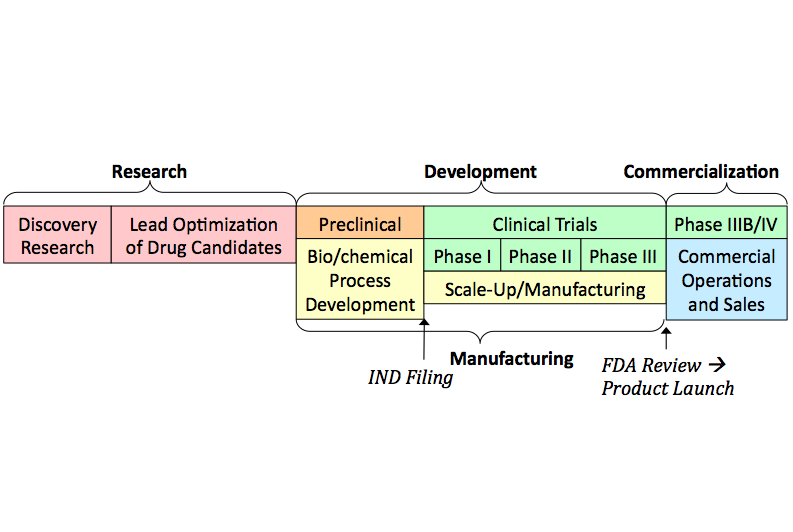

 在美國，想要投入生技產業的學生通常在大學時期會多修習生物方面的課程，充實自己的背景知識，也會在暑假申請到公司實習，培養實作經驗以及建立人脈，幫助畢業後順利就業。大學畢業之後，有些人會直接進公司工作，通常是先當研究助理（Research Associate），協助研究員（Scientist）的研究工作，但因為生技藥廠的研發單位中，要當研究員通常需要有博士的訓練，所以很多人做過一兩年的研究員之後，會選擇念研究所攻讀博士，也有很多學生因為知道有這樣的現象，選擇直接攻讀博士。在博士就學期間，最重要的是學會做研究的方法，同時也是累積對於某一個學術領域的知識進展的好時機。 以下就針對生技廠上游至下游各部門的機會做個簡介： .

**研究（ Research）**

生科類系所畢業的博士在許多工作崗位都能學以致用，除了在大學和其他學術單位教書做研究之外，在生技藥廠、醫療器材與診斷、和研究試劑等產業擔任研究員，也能進行研究工作，是許多喜好科學研究的人的理想選擇。在這些產業當中，研發（R&D）是分成研究（research）與發展（development）兩大塊不同領域，研究部門就像在大學生科系所一樣做實驗，只是研究題目以與疾病相關為主，發展部門則包含許多藥學上的觀念，需要幫藥進行毒性、藥效的測試，做細胞、動物、臨床試驗。

**發展（ Development）**

美國藥廠的發展部門當中大部分部門是與臨床試驗有關，通常聘用比較多醫藥專業人員，如醫學士（MD）、藥學士（PharmD）、或護士（RN），這些學位在美國都是學士後才進修的。相關工作包括與醫院溝通臨床實驗的進行（Clinical Affairs），還有安排通過醫藥管制法規的策略（Regulatory Affairs/Medical Affairs），這些跟醫院還有醫療本身相關的職務。但也不乏有生醫博士、公衛碩士（MPH）、或是擁有生醫和商管（MBA）或法律（JD）雙重背景的人進入這部門，較多是做跟寫作和法規有關的工作（Regulatory, Medical Writer），適合細心仔細且語文能力好的人投入。

**生產製造（ Manufacturing）**

醫材診斷產業的研發或是藥廠的生產部門需要能以工程角度思考的人。有些醫材的產品需要由工程師來設計，但這工程師最好懂生物、了解產品是如何應用的。在生產藥物方面，需要有製程工程師（process engineer）控制生產流程，經常是由化工背景的人擔任，如果用生物的方法製藥，則需要懂細胞培養或發酵，這類職務適合醫工背景的人來做。雖說如此，生物藥的生產過程還是與生物緊密結合，所以也需要很多生技背景的學士、碩士人才。

**專案管理 （Project Management）**

在以上提及的研發部門都經常需要專案經理（project manager），針對某一條產品線的發展，在各部門當中溝通協調。這樣的工作仰賴絕佳的溝通能力，因此很適合有生醫背景的 MBA，但如果是在大藥廠，專案經理不管在研究、發展、臨床、行銷等哪個部門，都需要對產品在該部門的流程有相當瞭解，因此通常要有在其他崗位的工作經驗再轉任，較不適合社會新鮮人。

**商品化行銷與銷售 （Commercialization）**

行銷和銷售方面主要是商管人才的領域，在生技產業也是如此。但有幾個產業中需要生技人的職務，包括 Field Applications Scientist 和 Technical Sales，他們靠著對科學的知識，了解產品的優缺點，到客戶端去進行演講或教學，教客戶公司產品為何好用，或如何使用公司產品，因為客戶是醫生與研究人員，所以他們也通常是對等的博士，才能用恰當的科學語言說服客戶，他們會和商管背景的業務合作銷售產品。

**商務發展 （Corporate）**

由於藥廠併購已經是現今任何藥廠都無法逃脫的命運，所有的生技藥廠都有新事業開發（business development，BD）的部門在進行相關活動。大藥廠的 BD 屬於高階工作，負責評估領域內的小公司及其技術與價值，當有與自身互補或是競爭的公司時，就協商併購。這樣的人通常兼有研究所學歷、生技產業工作經驗以及 MBA。小公司的 BD 則是尋找大公司來當買家或是出錢的合作夥伴，通常是由商管出身的人或 CEO 來做。

**創業（ Startup）**

生技產業的就業機會還包括創業，也是美國生技科系的研究生的熱門出路，有些學生從入學就開始找點子，準備畢業後開公司當老闆，在學校就是最容易累積人脈的地方，同時學校也經常有創業社團和課程活動可以參加，凝聚了學校所在城市的創業家，都來這裡會精英。創業最需要的是熱情與勇氣，其他需要的點子、資金、人力，都可以藉由擴展人脈，找到願意幫忙的夥伴或投資者，其實做起來沒有想像中困難，只是需要下決心去做，因此也是美國研究生愛好的職業選擇，因為就算失敗還是可以去找工作給別人聘，這段自主的時間反而是更快的學習成長，對履歷表也是加分。

**其他生技相關就業機會**

最後，除了進入生技產業外，生科博士還可能繼續進修攻讀專利法，或是轉入科技政策、科學期刊編輯、生技顧問公司、以及一般管理顧問公司，都是許多人投入、能夠學以致用的工作。

**參考資料**： Toby Freedman, “Career Opportunities in Biotechnology and Drug Development”, Cold Spring Harbor Laboratory Press, New York, 2007.
