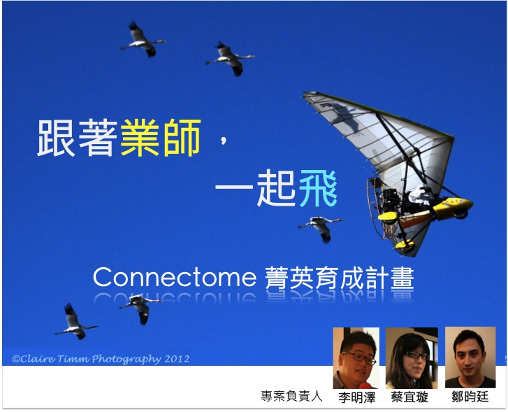
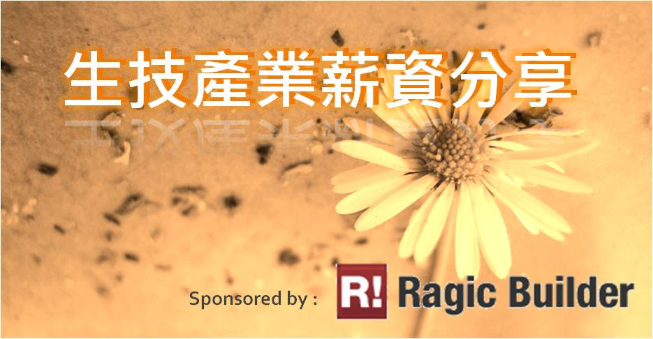

## **走過影響力的死亡幽谷**

從去年五月粉絲團成立，我們一直在摸索該分享什麼樣的資訊，如何兼顧專業性與易讀性等，因此籌備了一個小組專門收集國內外有關醫藥新知、產業動態、法規資訊、食品、中草藥等優質的資訊，藉由定期、穩定的分享，培養讀者定期閱讀的習慣，進而間接達到人才培育的目的。 然而這一切卻不是如想像的容易，facebook 的方便性與依賴性，在使用的同時卻也讓我們受限於它的規則，早期每天新增與迴響的人數可說是寥寥可數，因此我們不斷構思如何吸引讀者，於是誕生了專門解釋生技領域詞彙的 **[Connectionary](https://www.flickr.com/photos/97565412@N03/sets/72157634149166929/ "生醫詞彙")**、雙週重點回顧、部落格每週焦點、月報等，終於逐漸走過了影響力的死亡幽谷，進入穩定的成長期，也陸續接受 [rebuzz](http://rebuzz.tw/2013/06/connectome.html "呼叫生技人，還不知道 Connectome 就遜掉啦!") 、臺大生化科技系學會的採訪，讓更多人認識我們，粉絲團突破三千七百人。  .

## **堅持、累積、創造價值**

從上次的[半年回顧](/posts/connectome-review/ "用行動來延續熱情 - Connectome 半年回顧")至今，我們仍持續進行[活動資訊](/events/ "活動資訊")的匯整、介紹與更新，並且以更友善的介面呈現給讀者，藉此帶動活動參與的風氣，尤其是今年的實習資訊帶來高度的關注，也改變以往報名不甚踴躍的情況。 此外，我們亦不斷發想更多的活動主題，並推出更深入、高階的 Connectalk 論壇，以及海外經驗分享的 Mini-Forum，靠著我們的熱情與前輩的支持，讓 400 個以上的活動參與者有了新的想法、傳承實際的經驗，並且讓不同領域的人能夠互相交流。 而這些活動除了達到經驗分享與傳承的目的外，更讓團隊成員累積了許多經驗與產業的了解，也吸引到一些志同道合的夥伴加入我們。為了更具體且有效率的達到人才培育的目的，我們籌劃了 [Connectome 菁英育成計畫](/connectbar/connectome-elite-breeding/)，邀請在產業工作的許多前輩與我們分享自己在產業的觀察，並帶領成員分析或解決特定議題，以期能快速累積產業知識與思維，目前該計畫仍在內部試行中，預計未來將開放給更多有熱情的人參與。

Connectome菁英育成計劃，是為了生技產業人才培育所設計的最新計畫，期待引入更完整產業前輩們的見解與經驗，為台灣生技產業培育具有跨界能力視野的潛力領袖！藉由此計劃我們期待成為一個起點，協助培養業界所需人才，透過長期經營，成為改善台灣生技環境的推手。在此感謝熱心響應此計畫的眾多前輩，你們的參與無疑讓我們有更多動力前進與成長。

，.

## **Mind the gap**

"The gap is between doing nothing and doing something"，就是這樣的想法與態度讓我們積極的嘗試更多可能，利用有限的資源作出更多的事，也體會到默默做事雖然辛苦，但終有一天會顯現出價值。

例如我們彙整了國內外生技領域的企業，並附上求職的連結以及介紹，期待有競爭力的優質企業跟對的人才能更輕易的找到彼此，並且建立[生技產業薪資分享平台](/posts/salary-sharing-recruit/ "生技產業薪資匿名分享")，創造更透明與友善的求職環境。此外，我們的部落格也不斷推出新的系列文章，例如新聞導讀、學習資源介紹等，並將觸角延伸至海外，計畫帶來國外求學與就業的觀察與經驗談。

[「海外連結計畫」](/connectbar/oversea-connection-sharing-recruit/)，期待能與國內產業相互照映，促進國內外生技人之間的交流，重新燃起台灣生技產業的動力，提供在學生及職場新鮮人了解海外生技產業的管道，得以跳出窠臼妥善規劃其職涯，拓展產業視野。

.

## **未來展望**

我們一直希望 Connectome 的資訊傳遞模式從一對多 (Connectome to readers) 轉變為多對多 (Readers to readers)，讓生技產業的社群更加緊密與活絡，雖然目前已有些讀者響應徵文或加入團隊，但離目標仍有一段距離，因此若讀者有資訊分享或合作的意願，歡迎[聯絡我們](/posts/about-us/ "Contact us!")，讓我們知道您的想法，構築一個更活躍、豐富的生技產業社群組織。 當你主動參與時，你所能學到的遠比被動接受資訊來的多，期待讀者透過閱讀、投稿、活動參與等方式來加入我們，並感謝一路上支持、提供意見給我們的產業先進，讓我們有機會能創造一個更活躍、多元的生技產業社群。

### **期待有一天，我們將很難想像沒有 Connectome 的日子。**
